# SKCell

v0.13.4 by <a href="https://www.alexliugames.com/">Alex Liu</a>

SKCell is a powerful, comprehensive utility package for Unity that can greatly enhance your development experience.
Webpage: <a href="https://skyrim07.github.io/SKCell/#/">here</a>

## Features
<div class="row">
  <div class="column">
  <b>LOTS of utility functions!</b> 
  <br><br>One-line tweening and timed function calls, object pools, audio and video players, FSMs, CSV spreadsheet reader, game event system, 200+ util functions and extensions, scene loader, singleton and command patterns, etc.

  Head to <a href="##_1-common-utilities">Common Utilities</a> for more details.
  </div>
  <div class="column">
  <div align="center">
        
    </a>
</div></div></div>

<div class="row">
  <div class="column">
  <b>Dialogue System</b> 
  <br><br>Visualize your dialogue flow with a node editor. Multiple logic nodes are availale, such as options, random, boolean if/else, and custom events.
    <br>
    <br>
    See: <b><a href="##_8-dialogue-system">Dialogue System</a></b> 
  </div>
  <div class="column">
  <div align="center">
        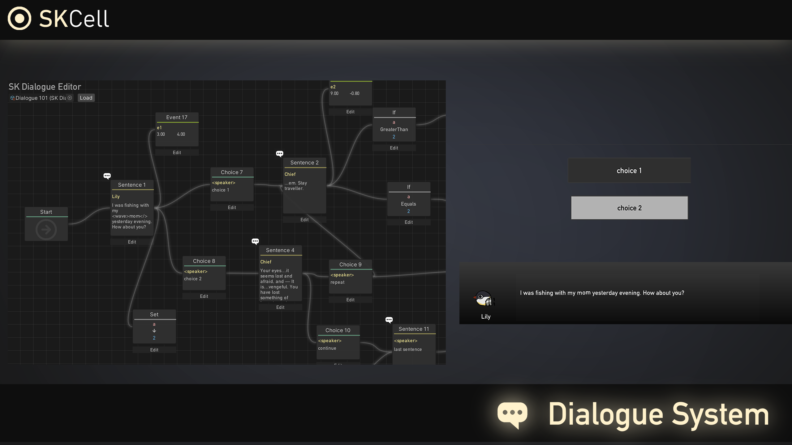
    </a>
</div></div></div>

<div class="row">
  <div class="column">
  <b>Text Animator</b> 
  <br><br>Quickly implement typewriter and text effects simply by labeling your texts. There are 17 built-in presets with customizable parameters.
      <br>
    <br>
    See: <b><a href="##_7-text-animator">Text Animator</a></b> 
  </div>
  <div class="column">
  <div align="center">
        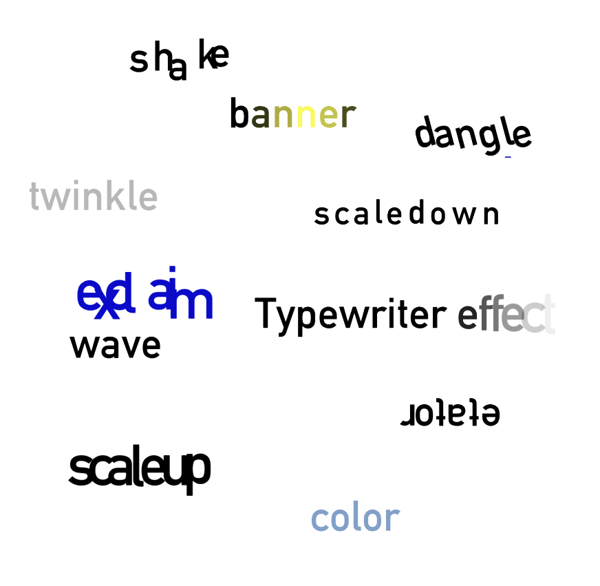
    </a>
</div></div></div>

<div class="row">
  <div class="column">
  <b>Image Effects</b> 
  <br><br>Customizable sprite and image effects including color grading, outline, shadow, blur, fading, and custom blend modes.
    <br>
    <br>
    See: <b><a href="##_6-effects">Effects</a></b> 
  </div>
  <div class="column">
  <div align="center">
        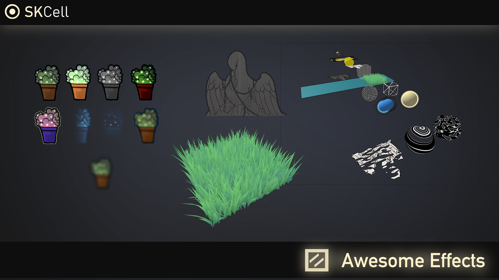
    </a>
</div></div></div>

<div class="row">
  <div class="column">
  <b>Revamped UI Components</b>
  <br><br>Versatile and time-saving UI components including buttons, sliders, toggles, toggle groups, panels, scrollers, texts, images, and UI particle systems.
  <br>
    <br>
    See: <b><a href="##_5-ui">UI</a></b> 
  </div>
  <div class="column">
  <div align="center">
        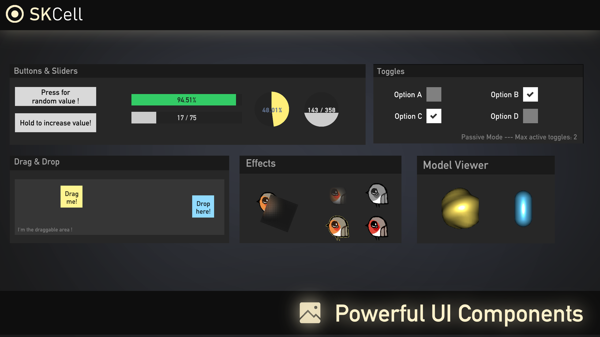
    </a>
</div></div></div>

<div class="row">
  <div class="column">
  <b>Localization</b> 
  <br><br>Integrated localization system with full editor window. Automatically works with SKCell UI components.
  <br>
    <br>
    See: <b><a href="##_9-localization">Localization</a></b> 
  </div>
  <div class="column">
  <div align="center">
        
    </a>
</div></div></div>


<div class="row">
  <div class="column">
  <b>Grid System</b> 
  <br><br>Powerful grid system with pathfinding. Grid values, costs, obstacles, and savable assets are also available.
  <br>
    <br>
    See: <b><a href="##_10-grid-system">Grid System</a></b> 
  </div>
  <div class="column">
  <div align="center">
        
    </a>
</div></div></div>

<div class="row">
  <div class="column">
  <b>Object Path Designer</b> 
  <br><br>Design a path for your Game Objects by setting multiple waypoints, wait times, movement tweening curves, and bezier curves.
  <br>
    <br>
    See: <b><a href="##_11-path-designer"> Path Designer</a></b> 
  </div>
  
  <div class="column">
  <div align="center">
        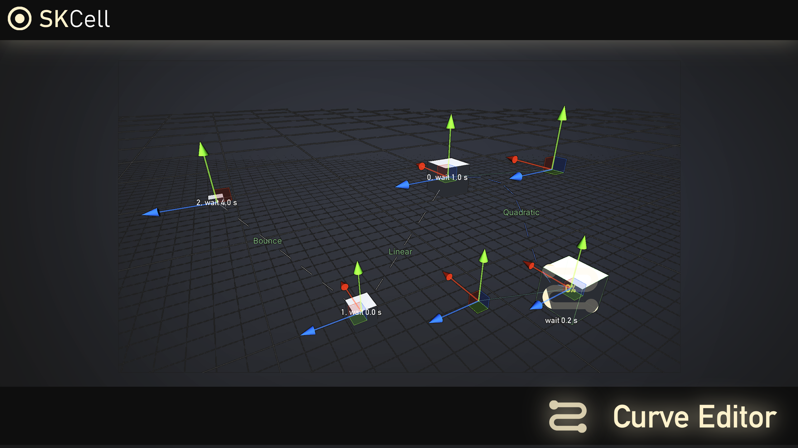
    </a>
</div></div></div>

<div class="row">
  <div class="column">
  <b>Better Editor Windows</b> 
  <br><br>Improved Unity editor windows (hierarchy, transform, project) with more accessible utilities and a better feel.
  <br>
    <br>
    See: <b><a href="##_14-editor-interfaces">Editor Windows</a></b> 
  </div>
  <div class="column">
  <div align="center">
        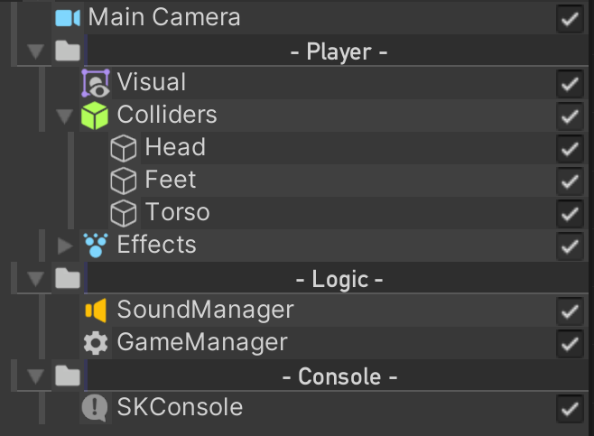
    </a>
</div></div></div>

## Get Started
SKCell is compatible with <b>Unity 2017.x</b> and newer.
<br>
<h5><b>Install</b><br></h5>
To integrate SKCell into your project, simply download a release (unity package). The latest version is v0.11.0.
Then, import the package into your project resource folder.<br>
Notice a folder named <b>SKCell</b> will appear under the Assets directory.<br>

<h5><b>Setup</b><br></h5>
To make SKCell functions available, create a new game object and add the <b>SKCore</b> component. This automatically adds some of the core components that SKCell relies on.
Make sure <b>SKCommonTimer</b> and <b>SKPoolManager</b> are attached.

<h5><b>Use</b><br></h5>
Include the <b>SKCell namespace</b> in your scripts to access SKCell classes. Try the following line of code to see if it works!

```csharp
using SKCell;
//...
CommonUtils.EditorLogNormal("Hello SKCell!");
```
Congratulations! You have now set up SKCell. Please check the documentation to see what it can do for you.

## Documentation

(Currently, this documentation page does not contain features from v0.12.0 and above. I will update this as soon as possible.)


### 1. Common Utilities
SKCell provides an abundency of useful utility functions, mostly in the static class <b>CommonUtils</b>.
#### 1.1 Logging
There are 5 logging functions (like Debug.Log) corresponding to 5 critical levels:<br>
<b>void EditorLogSafe(object message, bool detailed = false)</b><br>
<b>void EditorLogNormal(object message, bool detailed = false)</b><br>
<b>void EditorLogWarning(object message, bool detailed = false)</b><br>
<b>void EditorLogError(object message, bool detailed = false)</b><br>
<b>void EditorLogCritical(object message, bool detailed = false)</b><br>
<i>- Logs a message to the console with a time stamp. </i><br>
<i>- detailed: display the time difference between current and last call. </i><br>

```csharp
//EXAMPLE
CommonUtils.EditorLogError("Error message: item ID is -1!");
```
#### 1.2 Debugging 
<b>void DebugDrawCircle(Vector3 center, float radius, Color color, float duration, int divisions)</b><br>
<i>- Draw a circle using the Unity Debug.DrawLines.</i><br>
<i>- divisions: Number of lines forming the circle. Higher divisions give smoother shapes.</i><br>
<br>
<b>void DebugDrawRectangle(Vector3 minXY, Vector3 maxXY, Color color, float duration)</b><br>
<i>- Draw a rectangle using the Unity Debug.DrawLines.</i><br>
<i>- minXY: x and y coordinates of the lower left corner. (z component is not used)</i><br>
<i>- maxXY: x and y coordinates of the upper right corner. (z component is not used)</i><br>
<br>
<b>void DebugDrawText(string text, Vector3 position, Color color, float size, float duration)</b><br>
<i>- Draw a string of text using the Unity Debug.DrawLines.</i><br>

```csharp
//EXAMPLE
CommonUtils.DebugDrawText($"Position: {pos}",pos, Color.Red, 25.0f, 10.0f);
```
#### 1.3 Coroutines 
You can find more about this here: <a href="https://www.alexliugames.com/post/unity-coding-designs-02-delayed-function-calls">unity-coding-designs-02-delayed-function-calls</a><br>
<br>
<b>void InvokeAction(float seconds, Action callback, int repeatCount = 0, float repeatInterval = 1, string id = "", Action onFinish = null)</b><br>
<i>Invokes an action after <b>time</b> seconds, then repeatedly every <b>repeatInterval</b> seconds, stopping at <b>repeatCount</b> times.</i><br>
<i>callback: The function you want to call.</i><br>
<i>id: ID for this coroutine. Use it to stop the coroutine later.</i><br>
<i>onFinish: The function to call after this coroutine is finished.</i><br>
<br>
<b>void InvokeActionUnlimited(float seconds, Action callback, float repeatInterval = 1, string id = "")</b><br>
<i>Invokes an action after <b>time</b> seconds, then repeatedly every <b>repeatInterval</b> seconds. Will not stop.</i><br>
<br>
<b>void InvokeActionEditor(float seconds, Action callback)</b><br>
<i>Invokes an action after <b>time</b> seconds in the editor.</i><br>

```csharp
//Spawn Effect and Update UI after 3 seconds, then repeat 5 times every 1 second.
CommonUtils.InvokeAction(3.0f, ()=>
{
    SpawnEffect();
    UpdateUI();
},5,1);
```
Nested calls are also supported!

```csharp
//Do something after 1 second, then do something after 2 seconds.
CommonUtils.InvokeAction(1.0f, ()=>
{
    //...
    CommonUtils.InvokeAction(2.0f, ()=>
    {
        //...
    });
});
```
<br>
<b>void CancelInvoke(string id)</b><br>
<i>Stops an ongoing InvokeAction call specified by its id.</i><br>

```csharp
//EXAMPLE
CommonUtils.InvokeAction(3.0f, ()=>
{
  //...
},0,0,"action_07");
//...
CommonUtils.CancelInvoke("action_07");
```

#### 1.4 Tweening 
Make animation tweening effects with just a few lines of code! You can find more about this here: <a href="https://www.alexliugames.com/post/unity-coding-designs-04-tweening">unity-coding-designs-04-tweening</a><br>
<br>
<b>void StartProcedure(SKCurve curve, float time, Action<float> action, Action<float> onFinish = null, string id = "")</b><br>
<i>Starts a continuous procedure where a variable changes from 0 to 1 over time.</i><br>
<i>curve: The animation curve of this procedure.</i> See <a href="#?id=_31-skcurve">SKCurve.</a><br>
<i>time: Total time of this procedure.</i><br>
<i>action: Action is called every frame during this procedure. It is provided with a float variable from 0 to 1.</i><br>
<i>onFinish: The funtion called after the procedure is finished.</i><br>
<i>id: ID for this procedure. Use it to stop the procedure later.</i><br>

```csharp
//Bounce a ball from left to right in 2 seconds.
CommonUtils.StartProcedure(SKCurve.BounceIn, 2.0f, (t)=>
{
    ball.position = Vector3.Lerp(left, right, t); // t moves from 0 to 1
});
```
```csharp
//Fade in a image, then after 5 seconds, fade out.
CommonUtils.StartProcedure(SKCurve.LinearIn, 1.0f, (t)=> //fade in
{
    image.SetAlpha(t); // t moves from 0 to 1
},()=> //onFinish
{
    CommonUtils.InvokeAction(5.0f, ()=> //wait for 5 seconds
    {
        CommonUtils.StartProcedure(SKCurve.LinearOut, 1.0f, (t)=> //fade out
        {
            image.SetAlpha(t);// t moves from 1 to 0 (because the curve is suffixed out)
        });
    });
});
```
<i>* There are also some other overloads of this function. Please refer to the inline comments for further information.</i>
<br><br>
<b>void StopProcedure(string id)</b><br>
<i>Stops an ongoing StartProcedure call specified by its id.</i><br>

#### 1.5 Object Pooling
SKCell has a built-in object pool system. Be sure to have the <b>SKPoolManager</b> component in your scene.<br>
<br>
<b>GameObject SpawnObject(GameObject go)</b><br>
<i>- Spawn an object using the built-in object pool.</i><br>
<i>- returns: The spawned instance.</i><br>
<br>
<b>void ReleaseObject(GameObject go)</b><br>
<i>- Release ("destroy") an object in the built-in object pool.</i><br>
<br>
<b>void ReleaseObject(GameObject obj, float time)</b><br>
<i>- Release ("destroy") an object after some seconds.</i><br>

```csharp
//EXAMPLE
GameObject fx_prefab;
GameObject fx_instance = CommonUtils.SpawnObject(fx_prefab);
//...
CommonUtils.ReleaseObject(fx_instance);
```

#### 1.6 Destroying & Disabling 
<b>void Destroy(GameObject go)</b><br>
<i>Correctly destroys a game object in both play and edit modes. Skips if the object does not exist.</i><br>
<br>
<b>void SetActiveEfficiently(GameObject go, bool enabled)</b><br>
<i>Skips if the game object is already enables/disabled.</i><br>
<br>
<b>void DeactivateByTeleport(GameObject go)</b><br>
<i>Instead of disabling a game object, send it to a far location. Doing this is more efficient in most cases.</i><br>
<br>
<b>void ReactivateTeleportedObject(GameObject go)</b><br>
<i>Restore the teleported game object to its original position.</i><br>

#### 1.7 Input 
These functions require the <b>SKInput</b> component.
<br>
<b>void AddMouseDownAction(int mouseID, Action a)</b><br>
<i>Register an action on event of mouse down.</i><br>

```csharp
//EXAMPLE
void Start()
{
    CommonUtils.AddMouseDownAction(0,Jump);
}
void Jump(){}

//This is same as:
void Update()
{
    if(Input.GetMouseButtonDown(0))
    {
        Jump();
    }
}
void Jump(){}
```
<b>void RemoveMouseDownAction(int mouseID, Action a)</b><br>
<b>void AddMouseUpAction(int mouseID, Action a)</b><br>
<b>void RemoveMouseUpAction(int mouseID, Action a)</b><br>
<b>void AddKeyDownAction(KeyCode kc, Action a)</b><br>
<b>void RemoveKeyDownAction(KeyCode kc, Action a)</b><br>
<b>void AddKeyUpAction(KeyCode kc, Action a)</b><br>
<b>void RemoveKeyUpAction(KeyCode kc, Action a)</b><br>

#### 1.8 Graphics
 <br>
<b>void GLDrawLine(Vector3 v1, Vector3 v2, int drawMode = GL.LINES)</b><br>
<i> Draw a line using low-level graphics library.</i><br>
 <br>
<b>void GLDrawTriangle(Vector3 v1, Vector3 v2, Vector3 v3, int drawMode = GL.TRIANGLES)</b><br>
<i> Draw a triangle using low-level graphics library.</i><br>
 <br>
<b>void GLDrawQuads(Vector3 v1, Vector3 v2, Vector3 v3, Vector3 v4, int drawMode = GL.QUADS)</b><br>
<i> Draw a quad using low-level graphics library.</i><br>
 <br>
<b>void MeshNormalAverage(Mesh mesh)</b><br>
<i> Average the normals of a mesh. (in-place)</i><br>
<i> *This can be used in smooth outlining effects.</i><br>
 <br>
<b>void CombineMeshes(GameObject ori, GameObject tar)</b><br>
<i> Combine two meshes into one.</i><br>
<br>
<i> *[Legacy] There are several custom mesh related functions.</i><br>


#### 1.9 Base & Data 
<br>
<b>T[] Serialize2DArray<T>(T[,] arr)</b><br>
<i> Serialize a 2D array into a 1D array.</i><br>
<br>
<b>T[,] Deserialize2DArray<T>(T[] arr, int len1, int len2)</b><br>
<i> Deserialize a 1D array into a 2D array.</i><br>
<i> len1: row count.</i><br>
<i> len2: column count.</i><br>

```csharp
//2D array
{{1,2,3},
{4,5,6}}
//Serialized 1D array
{1,2,3,4,5,6}
```
<i>* This is for when 2D arrays are not compatible with certain serialization methods.</i><br>
<br>
<b>T[] ModifyArray<T>(T[] arr, int length)</b><br>
<b>T[,] Modify2DArray<T>(T[,] arr, int width, int height)</b><br>
<i> Change the length of an array while preserving its contents.</i><br>
<br>
<b> bool InsertOrUpdateKeyValueInDictionary<TKey, TValue>(Dictionary<TKey, TValue> dict, TKey key, TValue value)</b><br>
<i> Insert a key value pair into a dictionary. If the key already exists, update the value.</i><br>
<br>
<b> bool RemoveKeyInDictionary<TKey, TValue>(Dictionary<TKey, TValue> dict, TKey key)</b><br>
<i> Remove key in dictionary only if the key exists.</i><br>
<br>
<b> TValue GetValueInDictionary<TKey, TValue>(Dictionary<TKey, TValue> dict, TKey key)</b><br>
<i> Get value in dictionary only if the key exists.</i><br>
<br>
<b> void InsertToList<T>(List<T> list, T item, bool allowMultiple)</b><br>
<i> Insert an item into a list.</i><br>
<i> allowMultiple: If not, duplicate items will not be inserted.</i><br>
<br>
<b> void RemoveFromList<T>(List<T> list, T item)</b><br>
<i> Remove an item from a list only if the item exists.</i><br>
<br>
<b> void SwapValue<T>(ref T value1, ref T value2)</b><br>
<i> Swap two values.</i><br>
<br>
<b> void FillArray<T>(T[] arr, T item)</b><br>
<i> Fill the array with the item.</i><br>
<br>
<b> int CountInArray<T>(T[] arr, T item)</b><br>
<i> Get the count of item in array.</i><br>
<br>
<b> T[] RemoveDuplicatesInArray<T>(T[] arr)</b><br>
<i> Remove duplicates in array.</i><br>
<br>
<b> float MaxInArray(float[] arr)</b><br>
<i> Get the max float in array.</i><br>
<br>
<b> float MinInArray(float[] arr)</b><br>
<i> Get the min float in array.</i><br>
<br>
<b> string CompressString(string str)</b><br>
<i> Compress a string. (UTF-8 + GZipStream)</i><br>
<br>
<b> string DecompressString(string str)</b><br>
<i> Decompress a compressed string.</i><br>


#### 1.10 Math 
<br>
<b>Vector3 Angle2Vector(float angle)</b><br>
<i> Angle (degrees) to 2D vector. (e.g. 90 deg -> Vector2(1,0))</i><br>
<br>
<b>int Vector2Angle(Vector3 dir)</b><br>
<i> 2D vector to angle (degrees), rounded to the nearest integer. (e.g. Vector2(-1,0) -> 180 deg)</i><br>
<br>
<b>Vector3 ApplyRotationToVector(Vector3 vec, Vector3 vecRotation)</b><br>
<i> Rotate a vector.</i><br>
<i> vecRotation: rotation given by direction vector.</i><br>
<br>
<b>float SampleCurve(SKCurve curve, float x)</b><br>
<i> Sample an animation curve specified by an </i><a href="#?id=_31-skcurve">SKCurve.</a><br>
<i> x: time of the sample. (0-1)</i><br>
<br>
<b>float GetAngle(Vector3 selfDirection, Vector3 compareDirection)</b><br>
<i> Get the angle between two vectors.(-180 deg, 180 deg)</i><br>
<br>
<b>float GetAngleXZPlane(Vector3 selfDirection, Vector3 compareDirection)</b><br>
<i> Get the angle between two vectors on the XZ plane.</i><br>
<br>
<b>bool LinesIntersect2D(Vector3 ptStart0, Vector3 ptEnd0, Vector3 ptStart1, Vector3 ptEnd1,bool firstIsSegment, bool secondIsSegment)</b><br>
<i> Test if two 2D lines intersect.</i><br>
<i> firstIsSegment: does the first line has limited length?</i><br>
<i> secondIsSegment: does the second line has limited length?</i><br>
<br>
<b>bool LinesIntersect2D(Vector3 ptStart0, Vector3 ptEnd0, Vector3 ptStart1, Vector3 ptEnd1, bool firstIsSegment, bool secondIsSegment,ref Vector3 pIntersectionPt)</b><br>
<i> Test if two 2D lines intersect and get the intersection point.</i><br>
<br>
<b>Vector3 LineIntersectPlane(Vector3 point, Vector3 direct, Vector3 planeNormal, Vector3 planePoint)</b><br>
<i>  Get the intersection point between a line and a plane.</i><br>
<br>
<b>(bool intersect, Vector3 p1, Vector3 p2) LineIntersectSphere(Vector3 start, Vector3 end, Vector3 center, float radius)</b><br>
<i> Get the intersection point between a line and a sphere.</i><br>
<br>
<b>bool PointInRectangle(Vector3 rectCenter, Vector3 rectSize, float rotation, Vector3 point)</b><br>
<i> Is the point inside the given rectangle?</i><br>
<br>
<b>void CalcRectangleRotate(Vector3 rectCenter, Vector3 rectSize, float rotation,out Vector3 p1r, out Vector3 p2r, out Vector3 p3r, out Vector3 p4r)</b><br>
<i> Returns a rectangle rotated by <i>rotation</i> degrees.</i><br>
<br>
<b>bool LayerContains(LayerMask mask, int layer)</b><br>
<i> Does the layerMask contain the given layer?</i><br>
<br>
<b>int CalcStrCRC32(string p_str)</b><br>
<i>  return Animator.StringToHash(p_str);</i><br>
<br>
<b>int HashKey(Transform transform)</b><br>
<i>  Get the hash key of a transform. (only on windows)</i><br>
<br>
<b>bool IsPrime(int n)</b><br>
<i> Is the given int n a prime?</i><br>
<br>
<b>float Keep2Decimal(float num)</b><br>
<i> Round float to 2 decimal points.</i><br>
<br>
<b>float Keep2Decimal(float num)</b><br>
<i> Round float to 2 decimal points.</i><br>
<br>
<b>float ColorLuminance(Color c)</b><br>
<i> Get the luminance value of a color.</i><br>

#### 1.11 Reflection 
These reflection functions are quite self-explanatory.<br>
<br>
<b>FieldInfo[] GetConstants(System.Type type)</b><br>
<br>
<b>void CallMethod(string method, Type type, object param)</b><br>
<br>
<b>Type GetSpecificType(Type type)</b><br>
<br>
<b>List<Type> GetDerivedTypes(Type baseType)</b><br>
<br>
<b>bool IsSubclassOf(Type type, Type baseType)</b><br>
<br>
<b>bool IsSubclassOf(Type type, Type baseType)</b><br>
<br>

#### 1.12 I/O
 <br>
<b>void SaveObjectToJson(object obj, string fileName)</b><br>
<i> Serialize and save an object to Json file. Default path is root/json/.</i><br>
 <br>
<b>T LoadObjectFromJson<T>(string fileName)</b><br>
<i> Deserialize a json file. Default path is root/json/.</i><br>
<br>
<b>bool JsonFileExists(string fileName)</b><br>
<i> Test if the json file exists. Default path is root/json/.</i><br>
<br>
<i> *[Legacy] There are several SK versions of these functions.</i><br>

### 2. Extensions
Lots of useful extension methods are available to you.
#### 2.1 Transform
<b>void ResetTransform(this Transform tf, bool isLocal)</b><br>
<i>Reset the transform components to default.</i><br>
<i>isLocal: if true, reset local position, rotation, and scale.</i><br>
<br>
<b>void ResetPosition(this Transform tf, bool isLocal)</b><br>
<i>Reset the transform position to default.</i><br>
<br>
<b>void ResetLocalScale(this Transform tf)</b><br>
<i>Reset the transform local scale to default.</i><br>
<br>
<b>void ResetLocalRotation(this Transform tf)</b><br>
<i>Reset the transform local rotation to default.</i><br>
<br>
<b>void ResetGlobalRotation(this Transform tf)</b><br>
<i>Reset the transform global rotation to default.</i><br>
<br>
<b>void SetPositionX(this Transform tf)</b><br>
<i>Set the X component of the position.</i><br>

```csharp
//instead of this
transform.position = new Vector3(20,transform.position.y,transform.position.z);
//use this!
transform.SetPositionX(20);
```
<b>void SetPositionY(this Transform tf)</b><br>
<b>void SetPositionZ(this Transform tf)</b><br>
<br>
<b>void SetRotationX(this Transform tf)</b><br>
<b>void SetRotationY(this Transform tf)</b><br>
<b>void SetRotationZ(this Transform tf)</b><br>
<br>
<b>void SetScaleX(this Transform tf)</b><br>
<b>void SetScaleY(this Transform tf)</b><br>
<b>void SetScaleZ(this Transform tf)</b><br>
<br>
<b>void Get2DPosition(this Transform tf)</b><br>
<i>return new Vector3(tf.position.x, tf.position.y, 0);</i><br>
<br>
<b>void CopyFrom(this Transform selfTf, Transform otherTf)</b><br>
<i>Set the transform value from another transform.</i><br>
<br>
<b>List<Transform> GetAllChildren(this Transform tf)</b><br>
<i>Return an list of all the children of the given transform. (recursively)</i><br>
<br>
<b>void ClearChildren(this Transform tf)</b><br>
<i>Destroy all children.</i><br>
<br>
<b>void ClearChildrenImmediate(this Transform tf)</b><br>
<i>DestroyImmediate all children. (edit mode)</i><br>
<br>
<b>Transform CreateChild(this Transform tf)</b><br>
<i>Add a child with default transform values.</i><br>
<br>
<b>void SwapSiblingOrder(this Transform selfTf, Transform otherTf)</b><br>
<i>Swap sibling order with another sibling.</i><br>
<br>
<b>void SwapSiblingOrder(this Transform selfTf, Transform otherTf)</b><br>
<i>Swap sibling order with another sibling.</i><br>

#### 2.2 RectTransform
<b>bool Contains(this RectTransform a, RectTransform b)</b><br>
<i>Check if a ReectTransform contains another.</i><br>
<br>
<b>bool Overlaps(this RectTransform a, RectTransform b)</b><br>
<i>Check if a ReectTransform overlaps another.</i><br>
<br>
<b>Rect WorldRect(this RectTransform rectTransform)</b><br>
<i>Get a Rect in world space from a RectTransform.</i><br>
<br>

#### 2.3 Animator
<b>void Appear(this Animator anim)</b><br>
<i>anim.SetBool("Appear", true);</i><br>
<br>
<b>void Disappear(this Animator anim)</b><br>
<i>anim.SetBool("Appear", false);</i><br>
<br>
<b>void Pop(this Animator anim)</b><br>
<i>anim.SetTrigger("Pop");</i><br>
<br>
These are only by some conventions. <br>

```csharp
//instead of this
anim.SetBool("Appear", true);
//use this!
anim.Appear();
```

#### 2.4 Texture
<b>void SetColor(this Texture2D t, Color color)</b><br>
<i>Set the color of the entire Texture2D.</i><br>
<br>
<b>void SetQuad(this Texture2D t, Vector2Int lb, Vector2Int rt, Color color)</b><br>
<i>Set the color of a rectangular region of pixels in a Texture2D.</i><br>
<br>
<b>void AddQuad(this Texture2D t, Vector2Int lb, Vector2Int rt, Color color)</b><br>
<i>Add to the color of a rectangular region of pixels in a Texture2D.</i><br>
<br>
<b>void MultiplyQuad(this Texture2D t, Vector2Int lb, Vector2Int rt, Color color)</b><br>
<i>Multiply to the color of a rectangular region of pixels in a Texture2D.</i><br>

```csharp
//EXAMPLE
texture.SetQuad(new Vector2Int(0,0), new VectorInt(512,512),Color.Cyan);
```
<i>Be sure to apply the changes after calling these functions!</i><br>

#### 2.5 Data
<b>Vector2Int ToVector2Int(this Vector2 v)</b><br>
<i>Cast a Vector2 to a Vector2Int.</i><br>
<br>
<b>List<T> PopulateList<T>(this List<T> list, T content, int count)</b><br>
<i>Populate the list with a certain number of an item.</i><br>
<br>
<b>T[] PopulateArray<T>(this T[] array, T content, int count)</b><br>
<i>Populate the array with a certain number of an item.</i><br>
<br>
<b>float SimpleDistance(this Vector3 v, Vector3 v1)</b><br>
<i>Manhattan distance between vectors.</i><br>
<br>
<b>float SimpleDistanceSigned(this Vector3 v, Vector3 v1)</b><br>
<i>Manhattan distance between vectors where the order of vectors matters.</i><br>
<br>


### 3. Structures

#### 3.1 SKCurve
<div class="row">
  <div class="column">
  <b>SKCurve provides an easy way to access various animation curves.</b> 
  <br><br> Available built-in curves include: <br>
  - Linear<br>
  - Quadratic<br>
  - Cubic<br>
  - Quartic<br>
  - Quintic<br>
  - Sine<br>
  - Exponential<br>
  - Elastic<br>
  - Circular<br>
  - Bounce<br>
  - Back<br>
  </div>
  <div class="column">
  <div align="center">
        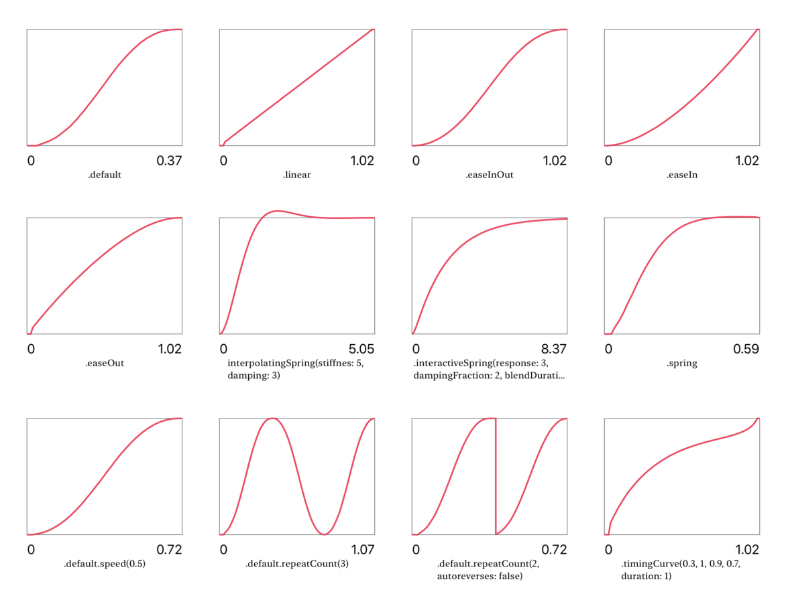
    </a>
</div></div></div>
All of the curve values are <b>from 0 to 1</b>. <br>
To get a curve, use SKCurve.xxx:

```csharp
SKCurve.CubicDoubleIn
SKCurve.BounceOut
SKCurve.LinearIn
```
<h5>Suffixes</h5><br>
    - The <b>Double</b> suffix indicates animation on both ends of the curve.<br>
    - The <b>In</b> and <b>Out</b> suffixes specifies the direction of the curve. <b>In</b> is from 0 to 1, while <b>Out</b> is from 1 to 0.<br>
<br>
<h5>Sampling</h5><br>
To sample a curve, use the <b>SKCurveSampler.SampleCurve</b> function:

```csharp
//sample the SineIn curve at x=0.7
float y = SKCurveSampler.SampleCurve(SKCurve.SineIn, 0.7f);
```

#### 3.2 Singletons
<h5>Non-Monobehaviour Singletons</h5><br>
To make your class a singleton (non-Monobehaviour), inherit from the <b>Singleton</b> class:

```csharp
using SKCell;

public class GameManager : Singleton<GameManager>
{

}
```
Then you can access this singleton using
```csharp
GameManager.instance
```
<h5>Monobehaviour Singletons</h5><br>
To make your class a Monobehaviour singleton, inherit from the <b>MonoSingleton</b> class:

```csharp
using SKCell;

public class Boss : MonoSingleton<Boss>
{

}
```
Then you can access this singleton using
```csharp
Boss.instance
```
<br>
<i>Note: If you would like to implement an Awake function in your singleton, be sure to override it.</i><br>

#### 3.3 Tree Node
TreeNode is a tree structure with these fields for each node:<br>
- name (string)<br>
- parent (TreeNode)<br>
- children (List<TreeNode>)<br>
- value (generic)<br>

<h5>Methods</h5><br>
<b>void AddChild(ITreeNode<T> child)</b><br>
<i>Add a child.</i><br>
<br>
<b>void AddChild(int index, ITreeNode<T> child)</b><br>
<i>Add a child at the given index.</i><br>
<br>
<b>void ClearChild()</b><br>
<i>Clear all children.</i><br>
<br>
<b>ITreeNode<T>[] GetAllChild()</b><br>
<br>
<i>Get all immediate children as an array.</i><br>
<b>ITreeNode<T>[] GetAllChildRecursive()</b><br>
<i>Get all children in the tree rooted at current node as an array.</i><br>
<br>
<b>ITreeNode<T> GetChild(int index)</b><br>
<i>Get a child at the given index.</i><br>
<br>
<b>int GetChildIndex(ITreeNode<T> child)</b><br>
<i>Get the index of a given child.</i><br>
<br>
<b>bool HasChild(string name)</b><br>
<i>Does the current node have a child with the given name?</i><br>
<br>
<b>void RemoveChild(int index)</b><br>
<i>Remove the child at the given index.</i><br>
<br>
<b>void RemoveChild(string name)</b><br>
<i>Remove the child with the given name.</i><br>
<br>
<b>void SetParent(ITreeNode<T> parent)</b><br>
<i>Set the parent of the current node.</i><br>
<br>
<b>void DetachFromParent()</b><br>
<i>Detach from the current parent.</i><br>
<br>

<h5>Tree Structure</h5><br>
The TreeStructure class gives a naive implementation of a tree using Tree Nodes.<br>
It has the following fields:

```csharp
private string name;
private ITreeNode<T> headNode;
private ITreeNode<T>[] nodeList;
```
<br><i>Please refer to the code for more details.</i><br>

#### 3.4 Priority Queue
You can find a priority queue implementation in the PriorityQueue class.<br>
Specify the order of the elements by setting <b>isDescending</b> when constructing:
```csharp
public PriorityQueue(bool isdesc) : this()
{
    IsDescending = isdesc;
}
```
<h5>Methods</h5><br>
<b>void Enqueue(T x)</b><br>
<br>
<b>T Dequeue()</b><br>
<br>
<b>T Peek()</b><br>
<br>
<b>void Clear()</b><br>

#### 3.5 Command Pattern
<h5>Command</h5>
The <b>Command</b> class is an abstract class representing a single command.<br>
Override the <b>Execute</b> and <b>Revert</b> methods in your own implementation.

```csharp
public class MyCommand:Command
{
    public override void Execute(params float[] args){
        //...
    }
    public override void Revert(params float[] args){
        //...
    }
}
```

<br>
<h5>CommandManager</h5>
The <b>CommandManager</b> class keeps a command stack and provide important functions for the command pattern to work.

After creating a Command, push it onto the stack by calling
```csharp
CommandManager.StackPush(command, args);
```
To repeat the last command, call
```csharp
CommandManager.Do();
```
To undo the last command, call
```csharp
CommandManager.Undo();
```
You can get the last command and its parameters with
```csharp
CommandManager.LastCommand
```
#### 3.6 Bezier Curve
The <b>SKBezier</b> class provides a simple representation of 3-Bezier curves.<br>
Each curve includes 2 endpoints and 2 control points:<br>
p0: first endpoint<br>
p1: first control point<br>
p2: second endpoint<br>
p3: second control point<br>
<br>
<h5>Functions</h5>
<b>Vector3 Sample(float t)</b><br>
<i>Sample the curve at the given time (0-1). Returns the sampled position.</i><br>
<br>
<b>Vector3[] Path(int segments)</b><br>
<i>Get the path representation of the curve. Divide the curve into certain number of segments and return the turn points.</i><br>
<br>
<b>float Length(int pointCount = 15)</b><br>
<i>Get the length of the path. Higher point count gives higher accuracy.</i><br>
<br>
<b>Vector3 Tangent(float t)</b><br>
<i>Get the tangent vector of the path (facing direction) at the given time.</i><br>
<br>

### 4. Events
The event system allows you to register to and execute events from anywhere without coupling.<br>
#### 4.1 Event Reference
You can give each event an integer ID using the <b>EventRef</b> class. There are 9 preset regions of event labels.<br>
```csharp
//EXAMPLE
public static readonly int CM_ON_SCENE_LOADED = 1000;
public static readonly int CM_ON_SCENE_EXIT = 1001;
//...
public static readonly int UI_CONV_ON_NEXT_SENTENCE = 5100;
public static readonly int UI_CONV_ON_SELECT_OPTION = 5101;
```
#### 4.2 Event Dispatcher
The <b>EventDispatcher</b> class manages registration and dispatching of events.<br>
<h5>Adding a listener</h5>
To add a listener to an event, use the <b>EventDispatcher.AddListener</b> method:
<b>bool AddListener(EventHandler handler, int id, SJEvent t_event)</b><br>

```csharp
//EXAMPLE
void Start()
{
    EventDispatcher.AddListener(EventDispatcher.Common, EventRef.CM_ON_SCENE_LOADED, new SJEvent(MyFunc));
}
```
<i>handler: There are 9 preset event handlers in EventDispatcher. Use the corresponding handler by typing EventDispatcher.xxx.</i><br>
<i>id: This is the event reference you created in EventRef.</i><br>
<i>t_event: The function you want to register to this event.</i><br>

<h5>Dispatching an event</h5>
To dispatch an event, use the <b>EventDispatcher.Dispatch</b> method:
<b>void Dispatch(EventHandler handler, int id)</b><br>

```csharp
//EXAMPLE
void OnSceneLoaded()
{
    EventDispatcher.Dispatch(EventDispatcher.Common, EventRef.CM_ON_SCENE_LOADED);
}
```
Everything registered onto the event will be executed.<br>

### 5. UI
SKCell has a powerful UI system built upon Unity's UGUI.
#### 5.1 SKButton
SKButton is a customizable, flexible button UI component with built-in animation & events without the need to code.<br>
<h5>Creating an SKButton</h5>
Inside a canvas, add a new game object. Then, attach the SKButton component onto it.<br>
Now you should see a <b>Generate Structure</b> Button:
<div align="left">
        
    </a>
</div>
Click on that button, your game object will be replaced by an SKButton preset.
 
<br>
<div align="left">
        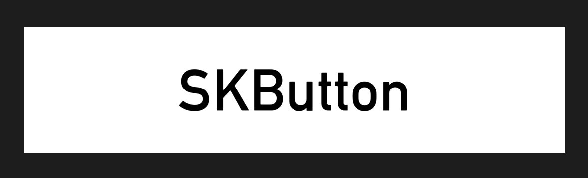
    </a>
</div>
Now try play it! This button should have mouse over and click animations.<br>

<h5>Customizing SKButton</h5>
<div class="row">
  <div class="columnTall">
  <b>Interactable</b> 
  <br>If turned off, the button will not respond to any events.<br>
  <br>
  <b>Button Image & Text</b> 
  <br>References. Do not need to change these in most circumstances.<br>
  <br>
  <b>Transition Mode</b> <br>
  There are 6 transition modes. The default is Color Image And Text.
  <br>
  <br>- Color Image Only<br>
  - Color Text Only<br>
  - Color Text Only<br>
  - Color Image And Text<br>
  - Animation<br>
  - None<br>
  <br>
  <b>Transition Time</b> 
  <br>Time of a single transition (sec).<br>
  <br>
  <b>Normal / Over / Press Colors</b> 
  <br>Set the colors here and the button will do the transition for you.<br>
  <br>
  <b>Use Scale Transition</b> 
  <br>Do you need scale animation for transitions?<br>
  <br>
  <b>Normal / Over / Press Scales</b> 
  <br>Set the scales here and the button will do the transition for you.<br>
  <br>
  <b>Spam Control</b> 
  <br>Prevent the user from clicking the button multiple times in a short time.<br>
  <br>
  </div>
  <div class="columnTall">
  <div align="center">
        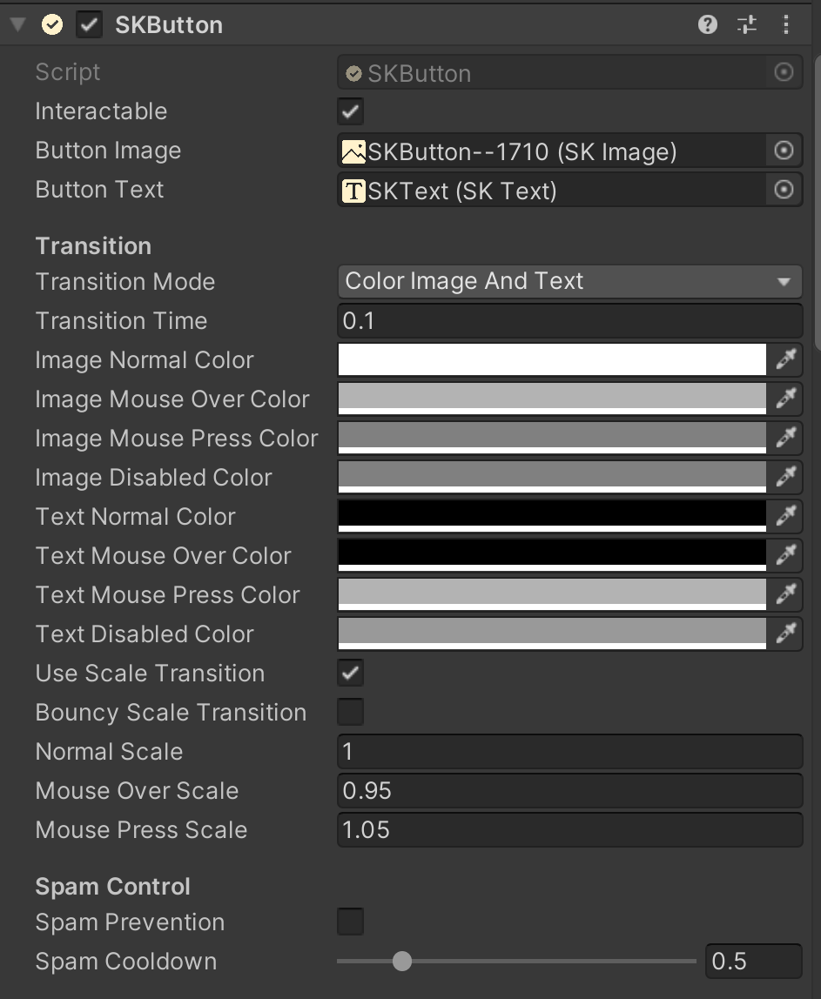
    </a>
</div></div></div>

<h5>Button Events</h5>
These are the events available. Register to them either from the editor or call the <b>SKButton.AddListener</b> method.<br>
- OnPress<br>
- OnHoldStays <br>
- OnHoldStaysForSeconds <br>
- OnHoldStaysForSeconds2 <br>
- OnHoldUp<br>
- OnHoldUp2<br>
- OnPointerEnter<br>
- OnPointerExit<br>
- OnPointerUp<br>
- OnPointerDown<br>
- OnStart<br>

```csharp
//Register a press & hold event (3 seconds)
myButton.holdForSecondsTime = 3.0f;
myButton.AddListener(SKButtonEventType.OnHoldStaysForSeconds, myFunc);

//Use current hold time to add visual effects
float sec = myButton.GetCurrentHoldTime();
FillSlider(sec/3.0f);
```

<h5>Methods</h5>
<b>void AddListener(SKButtonEventType type, UnityAction action)</b><br>
<i>Add a listener to an SKButton event.</i><br>
<br>
<b>void RemoveListener(SKButtonEventType type, UnityAction action)</b><br>
<i>Remove a listener from an SKButton event.</i><br>
<br>
<b>void RemoveAllListeners(SKButtonEventType type)</b><br>
<i>Remove all listeners from an SKButton event.</i><br>
<br>
<b>void SetText(string text)</b><br>
<i>Set the button text directly.</i><br>
<br>
<b>void UpdateText(int localID)</b><br>
<i>Set the button text using the <a href="##_9-localization">Localization system</a>.</i><br>
<br>
<b>float GetCurrentHoldTime()</b><br>
<i>Get the current hold time of this SKButton. Return 0 if not being held. </i><br>
<br>

#### 5.2 SKSlider
SKSlider is a customizable, flexible progress bar UI component with built-in animation & events without the need to code.<br>
<h5>Creating an SKSlider</h5>
Inside a canvas, add a new game object. Then, attach the SKSlider component onto it.<br>
Now you should see a <b>Generate Structure</b> Button:
<div align="left">
        
    </a>
</div>
Click on that button, your game object will be replaced by an SKSlider preset.
 
<br>
<div align="left">
        
    </a>
</div>
Now try adjusting its value in the editor!<br>

<h5>Customizing SKSlider</h5>
Be sure to click <b>Generate Structure</b> again to apply changes after you modify the style / structure of the slider!<br>
<div class="row">
  <div class="columnTall2">
  <b>Value</b> 
  <br>Value of the slider. (0-1)<br>
  <br>
  <b>Initial Value</b> 
  <br>Value of the slider on start. (0-1)<br>
  <br>
  <b>Style</b> <br>
  There are 2 slider styles:
  <br>- Linear<br>
  - Circular<br>
  <br>
  <b>Linear Direction</b> 
  <br>Direction for linear style.<br>
  <br>
  <b>Circular Pivot / Method / Direction</b> 
  <br>Starting point / fill method / fill direction for circular style.<br>
  <br>
  <b>Slider Background & Fill</b> 
  <br>References. Do not need to change these in most circumstances.<br>
  <br>
  <b>Fill Color</b> 
  <br>Color of fill.<br>
  <br>
  <b>Fill Color Transition</b> 
  <br>If turned on, fill color will change if slider value is over some threhold.<br>
  <br>
  <b>Fill Color Transition Threshold</b> 
  <br>Fill color will change if slider value is over this threhold.<br>
  <br>
  <b>Fill Color 2</b> 
  <br>Second fill color. The color to change into if slider value is over the threhold.<br>
  <br>
  <b>Fill Color Smooth Lerp</b> 
  <br>Smoothly or abruptly transition into fill color 2?<br>
  <br>
  <b>Fill Color Lerp Speed</b> 
  <br>Speed of smooth transition into fill color 2. Default is 0.1.<br>
  <br>
  <b>Progress Text Type</b> 
    There are 2 progress text types:
  <br>- Percentage (e.g. 95.01%)<br>
  - Part by Whole (e.g. 5/12)<br>
  <br>
  <b>Percentage Precision</b> 
  <br>Number digits after decimal point. (Percentage Mode)<br>
  <br>
  <b>Total Value</b> 
  <br>Total value. (Part by Whole Mode)<br>
  <br>
  <b>Text Color / Transition / Color 2 / Smooth Lerp / Lerp Speed</b> 
  <br>Same as those for fill color.<br>
  <br>
  <b>Smooth Transition</b> 
  <br>If turned on, slider value will change smoothly.<br>
  <br>
  <b>Lerp Speed / Threshold</b> 
  <br>Speed of smooth transition / threshold for the lerp (leave it as default in most circumstances).<br>
  <br>
  <b>Delayed Fill</b> 
  <br>Common effect involving a second fill area behind the fill that moves slower.<br>
  <br>
  <b>Delayed Fill Color Up</b> 
  <br>Color of delayed fill when the value increases. (e.g. health restore)<br>
  <br>
  <b>Delayed Fill Color Down</b> 
  <br>Color of delayed fill when the value decreases. (e.g. injury)<br>
  <br>
  <b>Delayed Fill Lerp Speed</b> 
  <br>Speed for delayed fill. Default is 0.2.<br>
  <br>
  </div>
  <div class="columnTall2">
  <div align="center">
        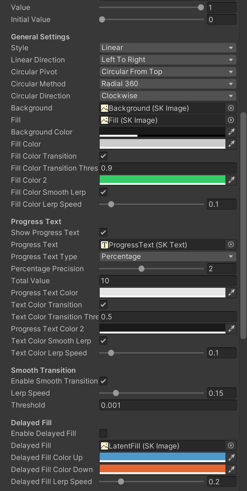
    </a>
</div></div></div>

<h5>Slider Events</h5>
These are the events available. Register to them from the editor.
- OnValueChanges<br>
- OnFull <br>
- OnEmpty <br>
- OnHalf <br>
- OnStart<br>

<h5>Methods</h5>
<b>void SetValue(float value)</b><br>
<i>Set the value of this SKSlider. Visual effects will be applied.</i><br>
<br>
<b>void SetValueRaw(float value)</b><br>
<i>Set the value of this SKSlider. Visual effects will NOT be applied.</i><br>
<br>
<b>void SetRandomValue()</b><br>
<i>Set a random value for this SKSlider.</i><br>
<br>

```csharp
//Set value of 0.2 to the slider.
mySlider.SetValue(0.2f);
```
<b>Difference styles an SKSlider can have: </b><br>

<div class="row">
  <div class="columnShort">
  Linear + Left to Right + Percentage Text + 2 Precision
  </div>
  <div class="columnShort">
  <div align="center">
        
    </a>
</div></div></div>
<div class="row">
  <div class="column">
  Circular + Bottom to Top + Percentage Text + 4 Precision
  </div>
  <div class="column">
  <div align="center">
        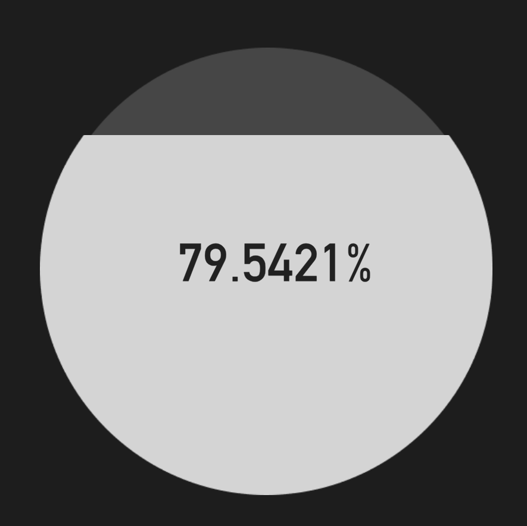
    </a>
</div></div></div>
<div class="row">
  <div class="column">
  Circular + Circular from Top + Radial 360 + Part by Whole Text
  </div>
  <div class="column">
  <div align="center">
         
    </a>
</div></div></div>

#### 5.3 SKToggle
SKToggle is a customizable, flexible toggle UI component with built-in animation & events without the need to code.<br>
<h5>Creating an SKToggle</h5>
Inside a canvas, add a new game object. Then, attach the SKToggle component onto it.<br>
Now you should see a <b>Generate Structure</b> Button:
<div align="left">
        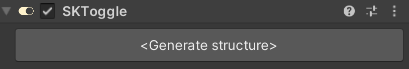
    </a>
</div>
Click on that button, your game object will be replaced by an SKToggle preset.
 
<br>
<div align="left">
        
    </a>
</div>
Now try play it! This toggle should have animations and interactivity.<br>

<h5>Customizing SKToggle</h5>
<div class="row">
  <div class="columnTall">
  <b>Interactable</b> 
  <br>If turned off, the toggle will not respond to any events.<br>
  <br>
  <b>IsOn</b> 
  <br>Current status of the toggle.<br>
  <br>
  <b>Can be toggled off</b> 
  <br>If on, the toggle will keep being on and not interactable.<br>
  <br>
  <b>Background & Selector & Text</b> 
  <br>References. Do not need to change these in most circumstances.<br>
  <br>
  <b>Toggle Group</b> <br>
  The Toggle Group this toggle belongs to. See <a href="#?id=_54-sktogglegroup">SKToggleGroup.</a><br><br>
  <b>Transition Mode</b> <br>
  There are 4 transition modes. The default is Background And Selector.
  <br>- Animation<br>
  - Background Only<br>
  - Selector Only<br>
  - Background And Selector<br>
  <br>
  <b>Background Colors</b> 
  <br>Color of background in various states.<br>
  <br>
  <b>Selector Colors</b> 
  <br>Color of selector in various states.<br>
  <br>
  <b>Text Colors</b> 
  <br>Color of text in various states.<br>
  <br>
  <b>Enable Text Transition</b> 
  <br>If off, text color will not change during transition.<br>
  <br>
  </div>
  <div class="columnTall">
  <div align="center">
        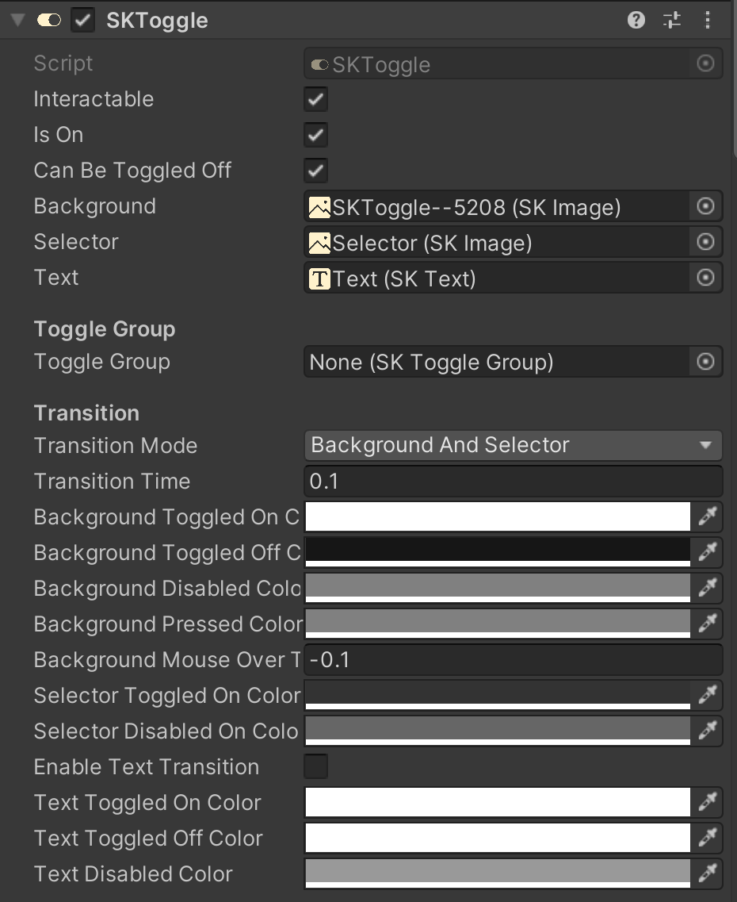
    </a>
</div></div></div>

<h5>Toggle Events</h5>
These are the events available. Register to them either from the editor or call the <b>SKToggle.AddListener</b> method.<br>
- OnToggled<br>
- OnToggledOn <br>
- OnToggledOff <br>
- OnPress <br>
- OnPointerEnter<br>
- OnPointerExit<br>
- OnPointerUp<br>
- OnPointerDown<br>
- OnStart<br>

```csharp
//Disable a game object when the toggle is toggled off.
myToggle.AddListener(SKToggleEventType.OnToggledOff, ()=>
{
    go.SetActive(false);
});
```

<h5>Methods</h5>
<b>void Toggle()</b><br>
<i>Toggle this toggle.</i><br>
<br>
<b>void ToggleOn()</b><br>
<i>Toggle this toggle on.</i><br>
<br>
<b>void ToggleOff()</b><br>
<i>Toggle this toggle off.</i><br>
<br>
<b>void AddListener(SKToggleEventType type, UnityAction action)</b><br>
<i>Add a listener to an SKToggle event.</i><br>
<br>
<b>void RemoveListener(SKToggleEventType type, UnityAction action)</b><br>
<i>Remove a listener from an SKToggle event.</i><br>
<br>
<b>void RemoveFromGroup()</b><br>
<i>Remove this toggle from the toggle group.</i><br>
<br>

#### 5.4 SKToggleGroup
SKToggleGroup clusters multiple SKToggles together with some collective behavior.<br>

<h5>Setting Up SKToggleGroup</h5>
1. Prepare several toggles<br>
2. Create a new SKToggle Group<br>
3. Drag the toggle group to each toggle<br>
4. Adjust toggle group settings for your needs<br>

<h5>Customizing SKToggleGroup</h5>
<div class="row">
  <div class="column2">
  <b>Mode</b> 
  <br>- Passive: No special actions.<br>
  <br>- Active One Only: There can only be 1 active toggle in this group.<br>
  <br>
  <b>Passive Mode Settings</b>
  <br> 
  <br>Max Active Toggle Count
  <br>Min Active Toggle Count<br>
  <i>Toggle group will satisfy these constraints automatically.</i><br>
  <br>
  <b>Passive Mode Events</b> <br>
  There are 2 events.
  <br>- On Max Reached: called when max active toggle count is reached.<br>
  - On Min Reached: called when min active toggle count is reached.<br>
  </div>
  <div class="column2">
  <div align="center">
        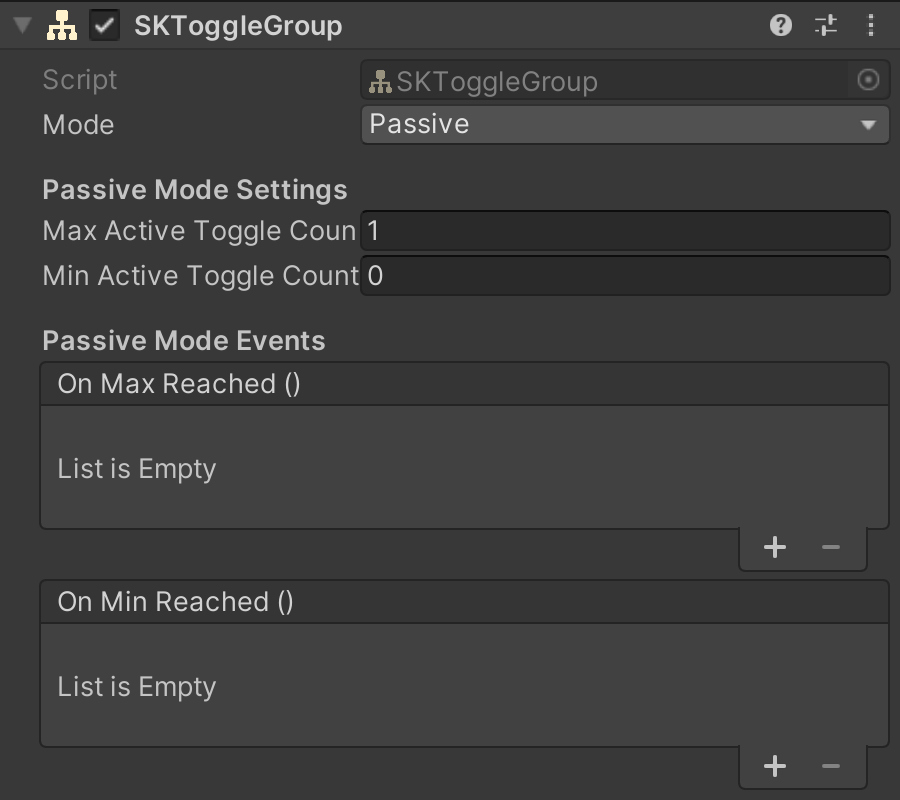
    </a>
</div></div></div>

#### 5.5 SKText
SKText is an extended component from TextMeshPro's Text. It is integrated with the text animator and the localization system.<br>
See <a href="##_9-localization">SKLocalization</a> and <a href="#?id=_54-sktogglegroup">SKTextAnimator</a> for more details.<br>
<h5>Methods</h5>
<b>void UpdateTextDirectly<T>(string newText)</b><br>
<i>Update text without <a href="##_9-localization">localization</a>.</i><br>
<br>
<b>void UpdateText<T>(T arg0)</b><br>
<b>void UpdateText<T>(T arg0, T arg1)</b><br>
<b>void UpdateText<T>(T arg0, T arg1, T arg2)</b><br>
<i>Update text with given arguments for <a href="##_9-localization">localization</a>.</i><br>
<br>
<b>void UpdateLocalID( int localID )</b><br>
<i>Update the <a href="##_91-local-entries-amp-local-id">local ID</a> for this text.</i><br>
<br>

<h5>Usage Example</h5>
To use SKText with localization: <br>
1. Set up some text entries in the <a href="##_92-localization-control-center">Localization Control Center</a><br>
2. Note down the <a href="##_91-local-entries-amp-local-id">local ID</a> of the text you want to display (e.g. 3012)<br>
3. Call:

```csharp
skText.UpdateLocalID(3012);
```
Then the text will update to be what local ID 3012 corresponds to.

To use SKText with text animator: <br>
1. Find the SKTextAnimator component attached to this SKText.<br>
2. Go to <a href="#?id=_54-sktogglegroup">SKTextAnimator</a> for more details.<br>

Inline text effects are active as default.<br>
For example, type <b>"\<wave>This is an example text.</>"</b> into the text box will apply wave effect to the text.<br>

#### 5.6 SKImage
SKImage is an extended component from UGUI's Image. It is integrated with the localization system.<br>
See <a href="#?id=_54-sktogglegroup">SKLocalization</a> for more details.<br>
<h5>Methods</h5>
<b>void UpdateImageDirectly(Sprite sprite)</b><br>
<i>Update image without <a href="##_9-localization">localization</a>.</i><br>
<br>
<b>void UpdateLocalID( int localID )</b><br>
<i>Update the <a href="##_91-local-entries-amp-local-id">local ID</a> for this image.</i><br>
<br>
<h5>Usage</h5>
Similar to SKText. The only difference is you need to set up an image localization in the <a href="##_92-localization-control-center">Localization Control Center</a>.<br>

#### 5.7 SKUIAnimation
SKUIAnimation gives multiple common transition animations to your UI.<br>
These animations are two-state, meaning that there are only 2 clips: one for active, one for inactive.<br>
<br>
Here are the available presets:<br>
- InstantAppear<br>
- AlphaFade<br>
- FadeLeft<br>
- FadeRight <br>
- FadeUp<br>
- FadeDown<br>
- ScaleUp<br>
- ScaleDown<br>
- AlphaFadeSlow<br>
- InstantInFadeOut<br>
- Shine<br>

To preview these effects, enter play mode and you can find 2 buttons in the inspector: <b>Preview State: Enter</b> and  <b>Preview State: Exit</b>. <br>
<br>
<div class="row">
  <div class="columnShort2">
  <b>Enter On Start</b> 
  <br>Is the state <b>Enter</b> or <b>Exit</b> on start?<br>
  <br>
  <b>Preset</b> 
  <br>The desired preset.<br>
  <br>
  </div>
  <div class="columnShort2">
  <div align="center">
        
    </a>
</div></div></div>

<h5>Using SKUIAnimation</h5>

It is extremely simple!<br>
1. Add SKUIAnimation component to a UI object.<br>
2. Select preset.<br>
3. Play!<br>

Use the following method to control the animation:<br>
```csharp
uiAnim.SetState(true);
//or
uiAnim.SetState(false);
```
Then the transition animation will play!<br>

<h5>Methods</h5>
<b>void SetState(bool appear)</b><br>
<i>Set the state of this animation. Play the corresponding state.</i><br>
<br>

#### 5.8 SKUIPanel
SKUIPanel represents a panel with animation, children, and parent structures.<br>
<div class="row">
  <div class="column">
  <b>Root Panel</b> 
  <br>Parent panel of this panel. This panel will be added as leaf on start.<br>
  <br>
  <b>PanelID</b> 
  <br>Integer ID of this panel.<br>
  <br>
  <b>Initial State</b> 
  <br>State of this panel on start. Will affect the SKUIAnimation component correspondingly.<br>
  <br>
  <b>Leaf Panel Method</b> 
  <br>Method to manage leaf panels.<br>
  <br><i>*Currently there is only one method: one leaf panel active. This option will keep only one leaf panel in its active state at the same time. You can create menu tabs with this.</i><br>
  <br>
  </div>
  <div class="column">
  <div align="center">
        
    </a>
</div></div></div>

<h5>Fields</h5>
<b>int lastActivatedLeaf</b><br>
<i>ID of the last activated leaf.</i><br>
<br>
<b>List<SKUIPanel> leafPanels</b><br>
<i>List of leaf panels.</i><br>
<br>

<h5>Methods</h5>
<b>void ActivateLeaf(SKUIPanel leaf)</b><br>
<b>void ActivateLeaf(int leafPanelID)</b><br>
<i>Set state of a leaf panel as active.</i><br>
<br>
<b>DeactivateLeaf(int leafPanelID)</b><br>
<i>Set state of a leaf panel as inactive.</i><br>
<br>
<b>void SetState(SKUIPanelState state)</b><br>
<i>Set state of current panel.</i><br>
<br>

#### 5.9 SKUIPanelManager
SKUIPanelManager manages all the SKUIPanels in the game.<br>
<h5>Panel Hierarchy</h5>
There are 7 preset panel hierarchies. They differ by their sorting order.<br>
- UILowermost -- 1<br>
- UILow -- 2<br>
- UIMain -- 3<br>
- UIHigh -- 4<br>
- UIHigher -- 5<br>
- UITopmost -- 6<br>
- UIConstant -- 7<br>
<br>
To create a UI root and view those hierarchies, select <b>SKCell/UI/BulidPanelHeirarchy</b> in the menu bar.

<h5>Methods</h5>
<b>void ActivatePanel(int panelID)</b><br>
<b>void ActivatePanel(SKUIPanel panel)</b><br>
<i>Set state of a panel as active.</i><br>
<br>
<b>void DeactivatePanel(int panelID)</b><br>
<b>void DeactivatePanel(SKUIPanel panel)</b><br>
<i>Set state of a panel as inactive.</i><br>
<br>
<b>int GetActivePanelCount()</b><br>
<i>Get count of currently active panels.</i><br>
<br>
<b>SKUIPanel GetPanelByID(int id)</b><br>
<i>Get panel by ID.</i><br>
<br>
<b>bool? IsActive(int panelID)</b><br>
<i>Is the given panel active? Returns null if panel does not exist.</i><br>
<br>
<b>void InstantiatePanel(int panelID, SKUIPanelState state, int predecessor = -1, Transform parent = null)</b><br>
<i>Instantiate a new SKUIPanel with the given info.</i><br>
<i>predecessor: the new panel will be instantiated one level lower in heirarchy than the predecessor.</i><br>
<i>parent: transform parent of the new panel.</i><br>
<br>
<b>public void InstantiatePanel(int panelID, SKUIPanelState state, SKUIPanelHierarchy hierarchy)</b><br>
<i>Instantiate a new SKUIPanel in the given panel hierarchy.</i><br>
<br>
<b>void DisposePanel(int panelID)</b><br>
<i>Destroy a given panel.</i><br>
<br>
<b>void DisposePanel(int panelID)</b><br>
<i>Destroy a given panel.</i><br>
<br>

#### 5.10 SKDragger
SKDragger adds dragging functionalities to a UI component.<br>
<div class="row">
  <div class="column2">
  <b>Dragger ID</b> 
  <br>Integer ID of this SKDragger.<br>
  <br>
  <b>Enable Physics Module</b> 
  <br>If on, 2D physics will be involved. This makes drag constraints, stickers, spawners, etc. possible. Default is on.<br>
  <br>
  <b>Center On Drag</b> 
  <br>Center the object at mouse position on drag. Default is off.<br>
  <br>
  <b>Is Camera Canvas</b> 
  <br>Select if this object exists in a camera canvas.<br>
  <br>
  <b>Constraint</b> 
  <br>Reference to a constraint rect transform. Dragged objects will not be allowed to go beyond the constraint area.<br>
  <br>
  <b>Self Bound</b> 
  <br>Reference to a self bound rect transform. This is the self area of this object. Use this rect transform as default.<br>
  <br>
  </div>
  <div class="column2">
  <div align="center">
        
    </a>
</div></div></div>

<h5>Events</h5>
<b>OnBeginDrag</b><br>
<b>OnDrag</b><br>
<b>OnEndDrag</b><br>
<b>OnEnterConstraint</b><br>
<b>OnLeaveConstraint</b><br>
<br>
These two events are tied with SKDragSpawner and SKDragSticker.<br>
<b>OnSpawn</b><br>
<b>OnDispose</b><br>
<br>

#### 5.11 SKDragSpawner
SKDragSpawner allows you to "drag out" a draggable UI object. (e.g. dragging objects in an inventory)<br>
<div class="row">
  <div class="column2">
  <b>Spawner ID</b> 
  <br>Integer ID of this SKDragSpawner.<br>
  <br>
  <b>Spawn Object</b> 
  <br>The object you want to spawn. <i>Be sure to have the SKDragger component on the spawn object!</i><br>
  <br>
  <b>Spawn Pos</b> 
  <br>Position to spawn. Use this transform as default.<br>
  <br>
  <b>Spawn Pos</b> 
  <br>Parent of spawned object. Use this transform as default.<br>
  <br>
  <b>Constraint</b> 
  <br>Constraint of the spawn object.<br>
  <br>
  <h5>Events</h5>
  <b>OnBeginDrag</b><br>
  </div>
  <div class="column2">
  <div align="center">
        
    </a>
</div></div></div>

#### 5.12 SKDragSticker
SKDragSticker attracts draggable objects, can think of this as a "destination".<br>
<div class="row">
  <div class="columnTall">
  <b>Sticker ID</b> 
  <br>Integer ID of this SKDragSticker.<br>
  <br>
  <b>Attract Force</b> 
  <br>Force with which this sticker attracts draggers. Default is 0.2.<br>
  <br>
  <b>Instant Stick</b> 
  <br>If on, draggers will be instantly placed onto the sticker without smooth transition.<br>
  <br>
  <b>Self Bound</b> 
  <br>Effective area of this sticker.<br>
  <br>
  <h5>Events</h5>
  <b>OnEnter</b><br>
  <b>OnStick</b><br>
  <b>OnExit</b><br>
  <h5>Usage</h5>
  Try use SKDragger, SKDragSpawner, SKDragSticker to make a simple draggable inventory!
  </div>
  <div class="columnTall">
  <div align="center">
        
    </a>
</div></div></div>

#### 5.13 SKSpriteButton
SKSpriteButton adds button-like functionalities to a sprite. No UI components are needed.<br>
 <h5>Usage</h5>
 To use SKSpriteButton, <br>
 1. Find an object with SpriteRenderer as the button. <br>
 2. Attach SKSpriteButton onto it. <br>
 3. Add a collider on the object as the interactable area. <br>
 4. Assign OnClick events if needed. <br>
 5. Play!<br>
 <br>
<div class="row">
  <div class="column2">
  <b>Allow Player Activation</b> 
  <br><i>[Deprecated]</i><br>
  <br>
  <b>Size Mouse Over</b> 
  <br>Size of button when mouse is over.<br>
  <br>
  <b>Size Mouse Down</b> 
  <br>Size of button when mouse is pressed.<br>
  <br>
  <b>Active One Time</b> 
  <br>If on, the button can be only pressed once.<br>
  <br>
  <b>Clip</b> 
  <br>Audio clip to play when clicked.<br>
  <br>
  </div>
  <div class="column2">
  <div align="center">
        
    </a>
</div></div></div>

#### 5.14 SKTranslationalSlider
A slider using image translation instead of image fill.<br>
Common usage include a translatable fill image inside a mask.<br>

 <h5>Fields</h5>
 <b>Slider Content</b> 
 <br>The object to slide.<br>
 <br>
 <b>Start Pos & End Pos</b> 
 <br>The slider content will move from start pos to end pos. (start pos when value = 0, end pos when value =1)<br>
 <br>
 <b>Progress Text</b> 
 <br>Text to display slider value as percentage. (2-precision)<br>
 <br>
 <b>Value</b> 
 <br>Value of slider. (0-1)<br>
 <br>

### 6. Effects

#### 6.1 SKImageProcessing
SKImageProcessing offers common image effects such as saturation, contrast, brightness, color shift, etc.<br>
<h5>Using SKImageProcessing</h5>
1. Add the component onto your image.<br>
2. Adjust the parameters!<br>

<h5>Supported Effects</h5>
<div class="row">
  <div class="columnShortW">
  <b>Original Image</b> 
  </div>
  <div class="columnShortW">
  <div align="left">
        
    </a>
</div></div></div>
<div class="row">
  <div class="columnShortW">
  <b>Customizable Blend Mode</b> 
  <br>Src Blend = OneMinusDstColor
  <br>Dst Blend = OneMinusSrcColor<br>
  </div>
  <div class="columnShortW">
  <div align="left">
        
    </a>
</div></div></div>
<div class="row">
  <div class="columnShortW">
  <b>Hue Shift</b> 
  <br>Hue shift = 0.8f
  </div>
  <div class="columnShortW">
  <div align="left">
        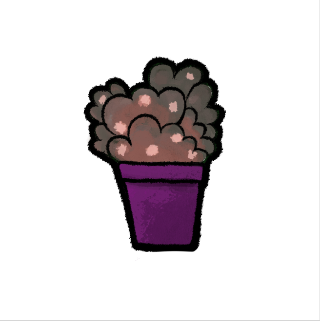
    </a>
</div></div></div>
<div class="row">
  <div class="columnShortW">
  <b>Brightness</b> 
  <br>Brightness = 2.0f
  </div>
  <div class="columnShortW">
  <div align="left">
        
    </a>
</div></div></div>
<div class="row">
  <div class="columnShortW">
  <b>Saturation</b> 
  <br>Saturation = 0.0f
  </div>
  <div class="columnShortW">
  <div align="left">
        
    </a>
</div></div></div>
<div class="row">
  <div class="columnShortW">
  <b>Contrast</b> 
  <br>Contrast = 1.5f
  </div>
  <div class="columnShortW">
  <div align="left">
        
    </a>
</div></div></div>
<div class="row">
  <div class="columnShortW">
  <b>Alpha Fading</b> 
  <br>Fade from bottom
  </div>
  <div class="columnShortW">
  <div align="left">
        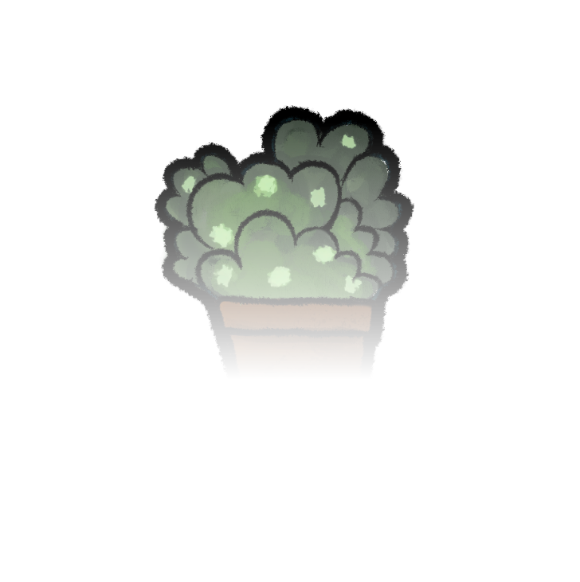
    </a>
</div></div></div>
<div class="row">
  <div class="columnShortW">
  <b>Alpha Fading</b> 
  <br>Fade from right
  </div>
  <div class="columnShortW">
  <div align="left">
        
    </a>
</div></div></div>
<i>*Fading from all directions is available.</i><br>
<br>
You can stack these effects on top of each other! For example, you can let the image fade from left while having a saturation value of 2.0f.<br>

Example to access this at runtime:
```csharp
const float BRIGHTNESS = 0.7f;
SKImageProcessing ip = go.GetComponent<SKImageProcessing>();
//Gradually increase go's brightness in 2 seconds
CommonUtils.StartProcedure(SKCurve.LinearIn, 2.0f, (t)=>
{
    ip.brightness = 1 + t * BRIGHTNESS;
});
```
Reference to <b>CommonUtils.StartProcedure</b>: <a href="#?id=_14-tweening">Tweening</a>.

#### 6.2 SKSpriteProcessing
This is a sprite version of <a href="#?id=_61-skimageprocessing">SKImageProcessing</a>. Functions are indentical.<br>

#### 6.3 SKBackBlur
Back blur effect is commonly used in games, such as the blurring of the scene when you open a menu.<br>
SKBackBlur makes it extremely easy to implement such effects.<br>

<h5>Using SKBackBlur</h5>
1. Add the component onto any image. The image will act as the area of blur.<br>
2. Place the image onto the area you want to blur! Be sure the image is <b>in front of</b> what you want to blur. <br>

<h5>Preview</h5>
<div class="row">
  <div class="columnShortW">
  <b>Original Image</b> 
  </div>
  <div class="columnShortW">
  <div align="left">
        
    </a>
</div></div></div>
<div class="row">
  <div class="columnShortW">
  <b>Blur = 3.0f</b> 
  </div>
  <div class="columnShortW">
  <div align="left">
        
    </a>
</div></div></div>
<div class="row">
  <div class="columnShortW">
  <b>Blur = 12.0f</b> 
  </div>
  <div class="columnShortW">
  <div align="left">
        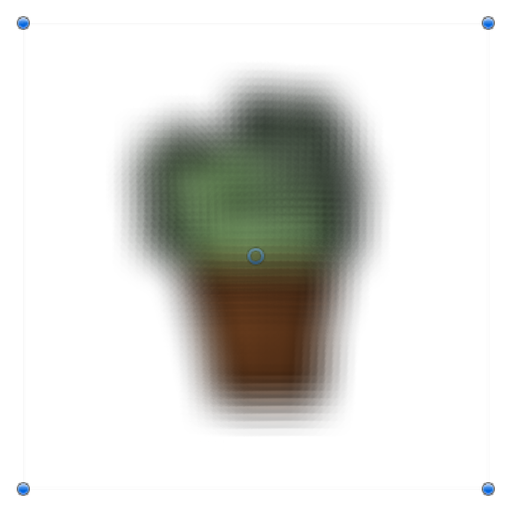
    </a>
</div></div></div>

You can also add additive & multiplicative tint to the blurred area.<br>

#### 6.4 SKSpriteBlur
Unlike SKBackBlur that blurs the background, SKSpriteBlur blurs the image it is attached onto.<br>

<h5>Preview</h5>
<div class="row">
  <div class="columnShortW">
  <b>Original Image</b> 
  </div>
  <div class="columnShortW">
  <div align="left">
        
    </a>
</div></div></div>
<div class="row">
  <div class="columnShortW">
  <b>Blur = 0.15f</b> 
  </div>
  <div class="columnShortW">
  <div align="left">
        
    </a>
</div></div></div>
<div class="row">
  <div class="columnShortW">
  <b>Blur = 0.8f</b> 
  </div>
  <div class="columnShortW">
  <div align="left">
        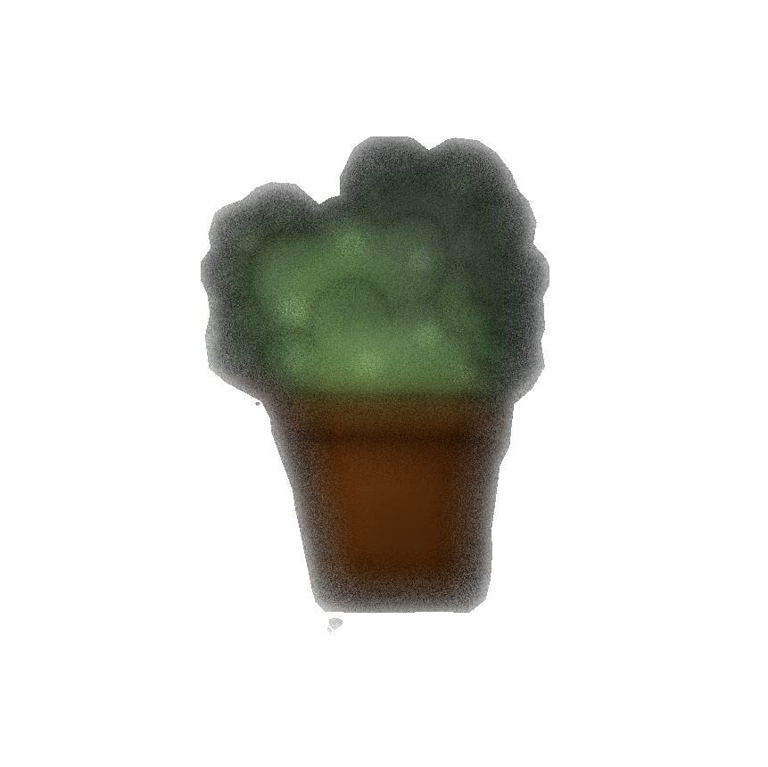
    </a>
</div></div></div>
Notice that this effect does not look really good for large blurs. I will try to fix this in later versions!<br>

#### 6.5 Light2D
<i>[Under Development] I plan to release this as a separate system. Currently the component is usable but not efficient.</i><br>

#### 6.6 SKUIParticleSystem
SKUIParticleSystem allows particle systems to be displayed as UI.<br>

<h5>Using SKUIParticleSystem</h5>
1. Add the component onto a UI object.<br>
2. A particle system component will be added automatically. Work with it like a normal particle system!<br>
<br>
<h5>Remarks</h5>
Check the settings in the inspector carefully.<br>
Be sure to adjust the "Max Particle Count" property! If too low, many of your particles will not be visible.<br>

#### 6.7 SKAnimationRandomizer
SKAnimationRandomizer randomizes the start time of an animation clip on play. A useful scenario would be where you have hundreds of grass objects with the same sway animation, and you want them to start asynchoronously so that it looks natural.<br>

<h5>Using SKAnimationRandomizer</h5>
1. Add the component onto an object with an animator.<br>
2. Play!<br>
<br>

### 7. Text Animator
SKCell offers a dynamic inline text animator which allows you to implement text effects just by marking the texts.<br>
It also comes with built-in typewriter effects.<br>
For example, <b></b>
<div class="row">
  <div class="columnShortW">
  <b>&ltdangle>Okay!&lt/> Let's see...</b><br>

  will be rendered as -->
  </div>
  <div class="columnShortW">
  <div align="left">
        
    </a>
</div></div></div>

<div class="row">
  <div class="columnShortW">
  <b>&ltwave>Impressive!&lt/></b><br>
  
  will be rendered as -->
  </div>
  <div class="columnShortW">
  <div align="left">
        
    </a>
</div></div></div>

<b>These effects are dynamic. Be sure to preview them in your editor!</b><br>

#### 7.1 Getting Started
SKTextAnimator will be automatically added when you use <a href="#?id=_55-sktext">SKText</a>.<br>
<div class="row">
  <div class="column">
  <b>After adding the SKText component, you should see an SKTextAnimator component as well.</b><br>
  <br>
  There are two major effects: <b>Typewriter</b> and <b>Inline Effects</b>.<br>
  </div>
  <div class="column">
  <div align="left">
        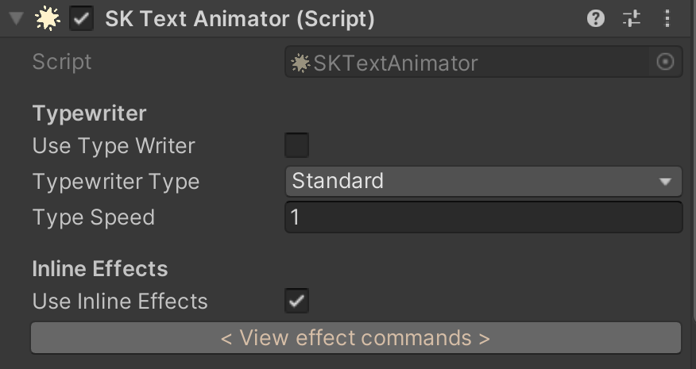
    </a>
</div></div></div>

#### 7.2 Typewriter Effects
To activate typewriter effects, simply check <b>Use Typewriter</b> in the inspector.<br>
<br>
Hit play now, the text should appear in a beautiful typewriter effect.<br>
Then you can adjust the <b>style</b> and <b>speed</b> to your needs.<br>
<br>
If you want to replay the effect later, call<br>

```csharp
textAnimator.PlayTypeWriter();
```

<h5>Example Effects</h5>
<div class="row">
  <div class="columnShortW">
  <b>Standard Typewriter</b><br>
  Alpha fade + scaling
  </div>
  <div class="columnShortW">
  <div align="left">
        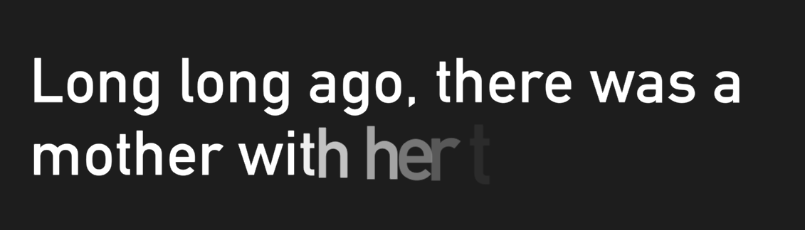
    </a>
</div></div></div>
<div class="row">
  <div class="columnShortW">
  <b>Rotate Typewriter</b><br>
  Alpha fade + rotation
  </div>
  <div class="columnShortW">
  <div align="left">
        
    </a>
</div></div></div>
<div class="row">
  <div class="columnShortW">
  <b>Wave Typewriter</b><br>
  Alpha fade + wave
  </div>
  <div class="columnShortW">
  <div align="left">
        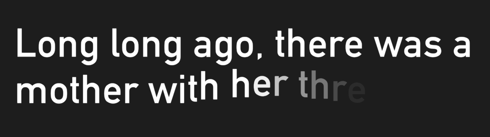
    </a>
</div></div></div>

<h5>All Presets</h5>
- Standard<br>
<br>
- Alpha Fade<br>
<br>
- Rotate<br>
<br>
- Wave<br>
<br>
- Translate<br>
<br>
- Shake<br>
<br>

<h5>Fast Forward</h5>
To fast forward a typewriter effect, call

```csharp
textAnimator.TypewriterFastForward();
```

#### 7.3 Inline Text Effects
You can easily add text effects to part of your text using the following syntax:<br>
<br>
\<EffectName & Parameters>Your Text </>
<br>
Simple examples are shown <a href="#?id=_7-text-animator">here</a>.

<h5>Effect Presets</h5>

You can view these by selecting <b>View Effect Commands</b> in the inspector.

 <div align="left">
        
    </a>
</div>

<h5>Simple Inline Effects</h5>
These are preset effects with fixed parameters. You can access these using only the effect name. That means, they do not accept any parameters.<br>
<br>
<b>- Shake: &ltshake><br></b>
<i>This effect shakes the characters individually at a high speed. Looping. Can (possibly) express: freezing, chill, horror, surprise, etc.</i><br>
<br>
<b>- Fade: &ltfade><br></b>
<i>This effect fades out the characters individually. Non-looping. Can (possibly) express: secret, embarassment, etc.</i><br>
<br>
<b>- Twinkle: &lttwinkle><br></b>
<i>This effect fades in and out the characters individually. Looping. Can (possibly) express: highlighting, treasure, etc.</i><br>
<br>
<b>- Dangle: &ltdangle><br></b>
<i>This effect dangles the characters. Non-looping. Can (possibly) express: dejected, discouraged, disappointment, etc.</i><br>
<br>
<b>- Exclaim: &ltexcl><br></b>
<i>This effect makes the characters "scream" (scale-up & shaking & color change). Looping. Can (possibly) express: excitement, surprise, etc.</i><br>
<br>
<b>- Timed Exclaim: &ltexclt><br></b>
<i>This is exclaim but non-looping. Will stop in a short time.</i><br>
<br>
<b>- Wave: &ltwave><br></b>
<i>This effect makes the characters flow up and down. Looping. Can (possibly) express: relaxation, humor, etc.</i><br>
<br>
<b>- Scale Up: &ltscaleup><br></b>
<i>This effect makes the characters bigger. Non-looping. Can (possibly) express: emphasis, highlighting, etc.</i><br>
<br>
<b>- Scale Down: &ltscaleup><br></b>
<i>This effect makes the characters smaller. Non-looping.</i><br>
<br>

Example:<br>

```
Wow, you got the <excl>MEDAL</>?
<dangle>This can't be true...</> I'm <shake>furious</>!
<wave>Hi, how's your day?</>
```
<h5>Parameterized Inline Effects</h5>
You can customize most of the effects by passing in parameters.<br>
The syntax is:<br>
<br>

```
<name(p1,p2,p3,...)>Your Text</>
```
For example,
```
//shake for 5 seconds
<shake(5)>Behold, the crown of Maloth!</>

//exclaim at 2x speed with the color of red
<excl(2,1,0,0)>Stop there, invader.</>
```
Details about these can be found in the inspector.

#### 7.4 Remarks
There are currently some limitations of this system.<br>
- Multiple effects on the same block of text is <b>NOT</b> supported. For example, 
```
//This is invalid
<wave><excl>Some Text</></>
```
- Be sure to follow the syntax precisely. For example,
```
//These are invalid because no space is allowed inside of <>
<shake (5.3) >Some Text</>
<shake( 5.3)>Some Text</>
```
- Do not use the <b>"\<"</b> character except for inline effects. This can result in a parse error. <i>*Will fix in later versions!</i>

### 8. Dialogue System
SKCell has a node editor system for creating and displaying dialogues. You do not need to write any code to implement simple dialogues.<br>

#### 8.1 Getting Started
<h5>How the dialogue system works</h5>
- Each dialogue is contained in an <b>SKDialogueAsset</b>.<br>
- You can edit the asset using the <b>SKDialogueEditor</b>.<br>
- Then the dialogue can be displayed using the <b>SKDialoguePlayer</b>.<br>

<h5>Opening the Dialogue Editor</h5>
Select <b>SKCell/Dialogue Editor</b> from the menu bar.<br> You will be directed to the following window.
<br>.
  <div align="left">
        
    </a>
</div>

<h5>Creating a Dialogue Asset</h5>
In your project window, right click, select <b>Create/SKCell/Dialogue Asset</b>.

<h5>Loading a Dialogue Asset</h5>
To load a dialogue asset, drag the asset to the top-left corner of the dialogue editor (or select it directly from the object field), then press <b>Load</b>.
<h5>Editing a Dialogue Asset</h5>
See <a href="##_82-sk-dialogue-editor">Dialogue Editor</a>.
<h5>Playing a Dialogue Asset</h5>
See <a href="##_84-sk-dialogue-player">Dialogue Player</a>.

#### 8.2 SK Dialogue Editor
The dialogue editor allows to to make dialogues by connecting nodes.<br>

<h5>Dialogue Flow</h5>
The dialogue will start with the <b>Start Node</b>. Then it will follow the connection you make to various nodes while executing those nodes along the way.<br>
At last, the dialogue will end either when reaching a deadend or the <b>End Node</b>.
<br>

<h5>Node Types</h5>
<br>
<div class="row">
  <div class="columnShort">
  <b>1. Start Node</b><br>
  The dialogue starts here. There can only be one start node in a dialogue.
  </div>
  <div class="columnShort">
  <div align="left">
        
    </a>
</div></div></div>
<div class="row">
  <div class="columnShort">
  <b>2. End Node</b><br>
  The dialogue ends here. When the end node is reached, the dialogue will stop.<br>
  There can be multiple end nodes.
  </div>
  <div class="columnShort">
  <div align="left">
        
    </a>
</div></div></div>
<div class="row">
  <div class="columnShort2">
  <b>3. Sentence Node</b><br>
  This represents a sentence. When a sentence node is reached, the correspond sentence will be displayed.
  <br>
  <br>
  <b>Editing a Sentence Node</b><br>
  Open the edit panel by clicking <b>Edit</b> at the bottom of the node.<br>
  You can assign speaker name / local ID (localized), content text / local ID (localized), audio clip, and avatar to the sentence.
  </div>
  <div class="columnShort">
  <div align="left">
        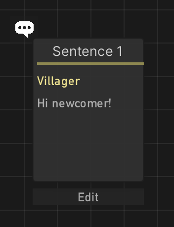
    </a>
</div></div></div>
<div class="row">
  <div class="columnShort2">
  <b>4. Choice Node</b><br>
  This represents a choice after a sentence. When a choice node is reached, several selectable choices will be displayed. The dialogue will not continue until a choice is selected by the player.
  <br>
  <br>
  <b>Editing a Choice Node</b><br>
  Open the edit panel by clicking <b>Edit</b> at the bottom of the node.<br>
  You can assign speaker name / local ID (localized) and content text / local ID (localized) to the choice.
  </div>
  <div class="columnShort">
  <div align="left">
        
    </a>
</div></div></div>
<div class="row">
  <div class="columnShort">
  <b>5. Random Node</b><br>
  When the random node is reached, the dialogue will randomly proceed to one of its connected nodes.
  </div>
  <div class="columnShort">
  <div align="left">
        
    </a>
</div></div></div>
<div class="row">
  <div class="columnShort2">
  <b>6. Event Node</b><br>
  When the event node is reached, an event will be executed with a name (identifier), and 2 float arguments.<br>
  Use <br>
    <b>void SKDialoguePlayer.AddListenerToEvent(string eventName, System.Action<float,float> callback)</b><br>
  to register to these events.<br><br>
  For example, you can add an item to player's inventory after a certain progression into the dialogue using event nodes.
  </div>
  <div class="columnShort">
  <div align="left">
        
    </a>
</div></div></div>
<div class="row">
  <div class="columnShort">
  <b>7. Set Node</b><br>
  When the set node is reached, the system will set the value of a variable defined by you.
  </div>
  <div class="columnShort">
  <div align="left">
        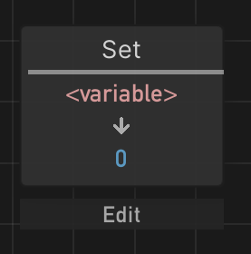
    </a>
</div></div></div>
<div class="row">
  <div class="columnShort">
  <b>8. If Node</b><br>
  When the if node is reached, a comparison involving a variable will be performed. If it passes, the dialogue moves on, if not, the dialogue ends here.
  </div>
  <div class="columnShort">
  <div align="left">
        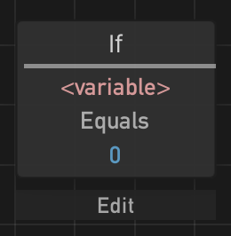
    </a>
</div></div></div>

<h5>Creating Nodes</h5>
Right click on an empty area and select <b>Create New Node/...</b> to create a new node.<br>
<br>
You can also right click on an existing node and and select <b>Create New Node/...</b> to create a new node connected from the existing node.

<h5>Connecting Nodes</h5>
To connect two nodes, right click on the first node, select <b>Link to...</b>, and left click on the second node.<br>
A curve will appear between these nodes.
 <div align="left">
        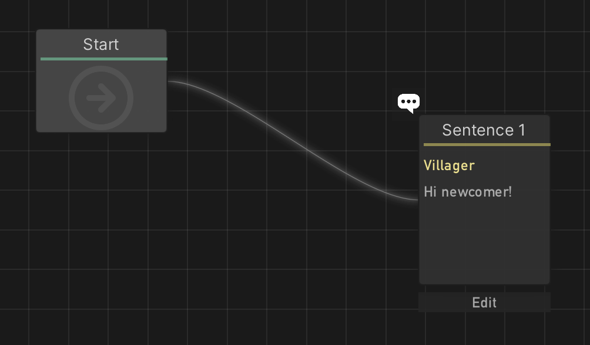
    </a>
</div>
<br>
<i>*Links are directed! Source and destination nodes are not exchangeable.</i>
<br><br>
To delete a connection, right click on the source node and select <b>Unlink.../</b> to unlink a specific connection.<br>

<h5>Multiple Links</h5>
You can connect multiple nodes to one node.<br>
 <div align="left">
        
    </a>
</div>
<br>
In this case, all connected nodes will be <b>executed at once</b>.<br>
<i>*Because of this, do not connect multiple sentences to a single node (except for the random node). It will not make sense.</i>

#### 8.3 Dialogue Flow Examples
Here are some useful examples to further illustrate how the editor works.<br>

<b>1. Simple Linear Dialogue</b>
<div align="left">
        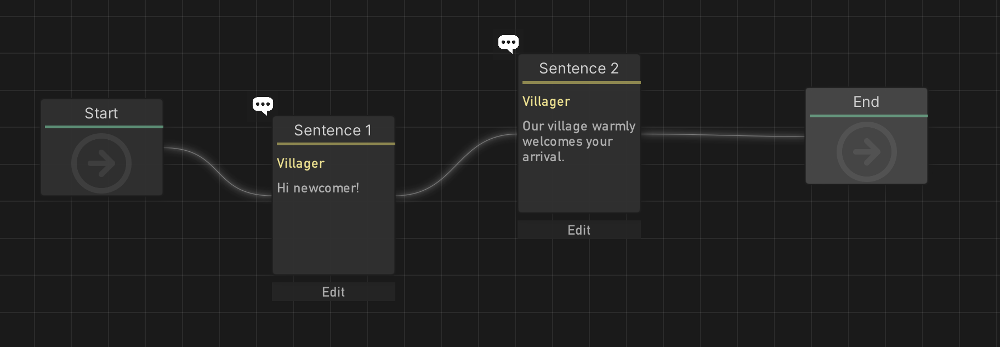
    </a>
</div>
<br>
To display some linear sentence sequence, connect them in order between start and end nodes.<br>

<b>2. Branching Choices</b>
<div align="left">
        
    </a>
</div>
<br>
The dialogue will go differently depending on the choices the player makes.<br>

<b>3. Random</b>
<div align="left">
        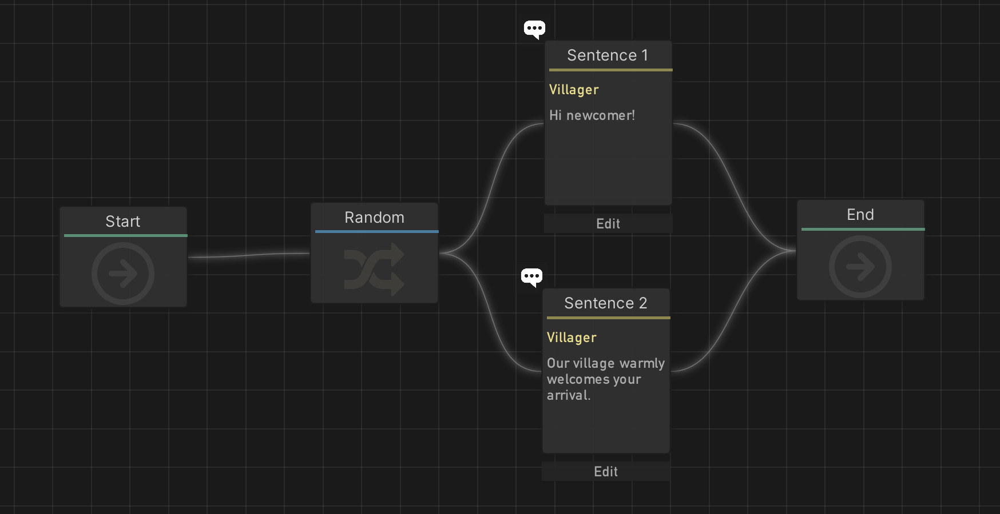
    </a>
</div>
<br>
The dialogue will randomly display one of the sentences.<br>

<b>4. Branching Variables</b>
<div align="left">
        
    </a>
</div>
<br>
The dialogue will go differently according to the variable.<br>

<b>5. Loops</b>
<div align="left">
        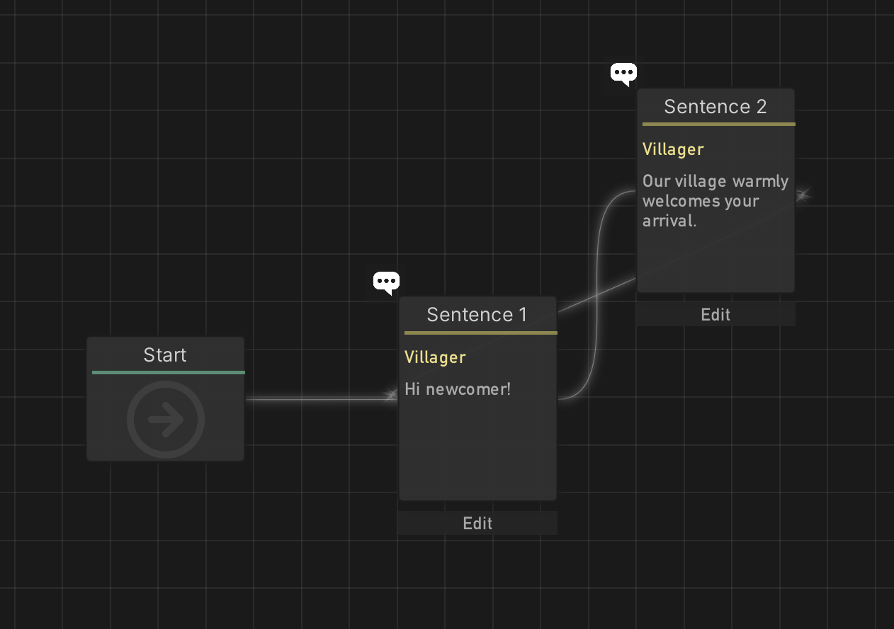
    </a>
</div>
<br>
You can make connections to previous parts of the dialogue. In this example, the dialogue will never end.<br>

#### 8.4 SK Dialogue Player
SKDialoguePlayer is the component that actually plays the dialogue asset.<br>

You can find a prefab of the structure required by SKDialoguePlayer in <b>SKCell/Resources/SKCell/Prefabs/SKDialogue</b>.

<h5>To Use SKDialoguePlayer</h5>
1. Create a new game object.<br>
2. Add the SKDialoguePlayer component.<br>
3. Click <b>Generate Structure</b>.<br>
4. Assign the dialogue asset.<br>
5. Play!<br>

<h5>Structure</h5>
<div class="row">
  <div class="columnTall">
  <b>Generate Structure</b> 
  <br>This generate a preset structure for the Dialogue Player to work. It will assign the requires references automatically. You can customize it afterwards.<br>
  <br>
  <b>Asset</b> 
  <br>The dialogue asset to play.<br>
  <br>
  <b>Scene Components</b> <br>
  <b>Panel</b> 
  <br>The overall dialogue panel (<a href="##_58-skuipanel">SKUIPanel</a>).<br>
  This mainly controls the appearing / disappearing of the panel. <br>
  <br>
  <b>Content & Speaker Text</b> 
  <br>Text components for displaying the content and the speaker. (<a href="##_55-sktext">SKText</a>).<br>
  Thanks to the <a href="##_7-text-animator">SKTextAnimator</a> functionalities that comes with SKText, you have typewriter effects automatically implemented! <br>
  <br>
  <b>Choice Panel</b> 
  <br>The panel to display selectable choice buttons (<a href="##_58-skuipanel">SKUIPanel</a>).<br>
  <br>
  <b>Choice Objects & Texts</b> 
  <br>References to the actual choice objects. The default count is 3; if you want more or fewer choices, feel free to modify this.<br>
  <br>
  <b>Speaker Image</b> 
  <br><a href="##_56-skimage">SKImage</a> component that displays speaker's avatar.<br>
  <br>
  <b>Content Button</b> 
  <br>The button component that allows players to continue with the dialogue. (click for the next sentence) Normally this has the size of the dialogue frame.<br>
  <br>
  <b>Choice Buttons</b> 
  <br>The button components for each of the choice objects.<br>
  <br>
  </div>
  <div class="columnTall1">
  <div align="center">
        
    </a>
</div></div></div>

<h5>Events</h5>
<b>OnDialogueStart</b><br>
<b>OnDialogueEnded</b><br>

<h5>Methods</h5>
<b>void Play()</b><br>
<i>Play the assigned dialogue asset.</i><br>
<br>
<b>void Play(SKDialogueAsset asset)</b><br>
<i>Play a dialogue asset.</i><br>
<br>

<b>void AddListenerToEvent(string eventName, System.Action<float,float> callback)</b><br>
<i>Register to one of the events in the dialogue.</i><br>
<i>eventName: the name you specify in the dialogue editor.</i><br>
<i>callback: the function you want to call. The two float parameters correspond to what you specify in the dialogue editor.</i><br>

```csharp
//EXAMPLE
SKDialoguePlayer player;
player.AddListenerToEvent("On Trade Complete", (id,count)=>
{
    AddItem(id, count);
});
```

### 9. Localization
SKCell has a easy-to-use localization system for texts and images.<br>
<i>Audio localization will be available in later versions.</i>

<h5>How It Works</h5>
- All text and image entries are identified by a unique <b>Local ID.</b><br>
- Each entry includes content for multiple languages.<br>
- Text and image components will read from the entries according to the currently active language.<br>

#### 9.1 Local Entries & Local ID

<h5>Local Entries</h5>
<div class="row">
  <div class="column">
  <b>Text Entry (example)</b> 
  <br><br>Local Text ID: local ID for this text entry.<br>
  <br>Comments: you can type in comments next to the local ID. Comments are only there for reference.<br>
  <br>
  Language fields: you can type in the content for the supported languages here.<br>
  <h5>Local ID</h5>
  Local IDs are unique identifiers each corresponding to a local entry. This is the only way to access local entries.
  </div>
  <div class="column">
  <div align="center">
        
    </a>
</div></div></div>
<h5>Accessing Local Entries</h5>
You can access a text entry by:

```csharp
SKLocalization.GetLocalizationText(int localID);
```
#### 9.2 Localization Control Center
Localization Control Center is the place where you can manage and edit the localizaed content. <br>
Open by selecting <b>SKCell/Localization Center</b> from the menu bar.<br>
<br>
 <div align="center">
        
    </a>
</div>

There are four sections: <b>Text Localization</b>, <b>Image Localization</b>, <b>Language Support</b>, and <b>Font Chart</b>.<br>
<br>
Text and Image Localization sections simply contains all the <b>Local Entries</b>. You can add/edit/remove entries here.
<h5>Language Support</h5>
 <div align="center">
        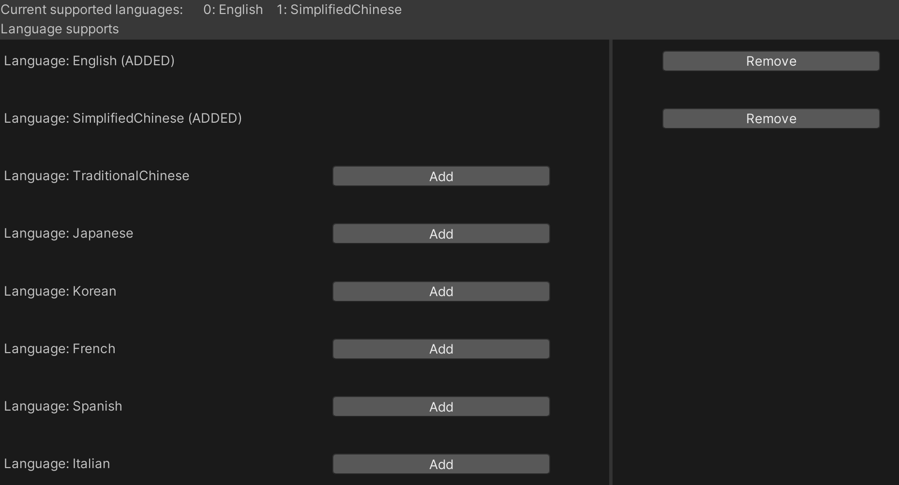
    </a>
</div>

You can add/remove supported languages here. 
<b>Only supported languages are visible in text and image localization sections.</b><br>
Each local entry contains all contents of the available languages. Therefore removing a supported language will not delete the data related with that language. If you add the language back again, the content will appear.<br>
Supported languages are only filters by which the local entries display.<br>

<h5>Font Chart</h5>
You can assign different fonts for each local entry.<br>
Do so by filling the <b>Font Override</b> field beside each local entry. Each font corresponds to an integer ID which you can specify in the font chart.<br>

<h5>Saving & Loading</h5>
You can save / load the localization asset by pressing the buttons at the bottom of the control center. <b>There can only be one localization asset for each project.</b>
<br><br>
<b>Auto saving is not available!</b> Be sure to hit the Save button each time you finish editing!<br>

#### 9.3 Usage

Text localization is bestly integrated with the <a href="##_55-sktext">SKText</a> component.<br>
<h5>Text Localization with No Arguments</h5>
To localize texts with no arguments (meaning that they are immutable), simply fill in the text entry with the predetermined translation for each language, note down the local ID, then use the <b>UpdateLocalID</b> method:

```csharp
//EXAMPLE
const int MY_LOCAL_ID = 5135;
skText.UpdateLocalID(MY_LOCAL_ID);
```
Alternatively, you can fill in the local ID in the inspector as well. This will act as a initial value.<br>

<h5>Text Localization with Several Arguments</h5>
Oftentimes the text we want to localize is not static. For example, <br>
<br>
ENG: There are 3 apples.<br>
CHN: 那里有3个苹果。<br>
<br>
Notice that there exists a variable in the sentence, (3 in this example).<br>
<br>
In this case, you can leave formatting indicators in the sentence to reserve places for these variables. (like when doing string formatting)<br>
Therefore you would fill in the local entries like this:<br>
<br>
ENG: There are {0} apples.<br>
CHN: 那里有{0}个苹果。<br>
<br>
Then use the <b>UpdateText</b> method:

```csharp
//First update the local id
const int MY_LOCAL_ID = 5135;
skText.UpdateLocalID(MY_LOCAL_ID);
//Then pass in the arguments
skText.UpdateText(3);
```
Similarly, this works for at most 3 arguments.<br>
<br>
ENG: You score is {0}. Your best score is {1}. Time: {2}. <br>
CHN: 得分：{0}；最高分：{1}；用时：{2}.<br>
<br>
Then use the <b>UpdateText</b> method:

```csharp
//First update the local id
const int MY_LOCAL_ID = 5135;
skText.UpdateLocalID(MY_LOCAL_ID);
//Then pass in the arguments
skText.UpdateText(14000,23000,90.95f);
```
The text will be formatted as:<br>
<br>
ENG: You score is 14000. Your best score is 23000. Time: 90.95. <br>
CHN: 得分：14000；最高分：23000；用时：90.95.<br>
<br>
<h5>Image Localization</h5>
Text localization is bestly integrated with the <a href="##_56-skimage">SKText</a> component.<br>
This works similar as text localization with no arguments.<br>
<br>
First fill in the local entries, then use the <b>UpdateLocalID</b> method:

```csharp
//EXAMPLE
const int MY_LOCAL_ID = 5135;
skImage.UpdateLocalID(MY_LOCAL_ID);
```

#### 9.4 SKLocalizationManager
SKLocalizationManager manages the localization system globally.<br>

It provides the following helper functions:<br>
<br>
<b>void Localize(GameObject go)</b><br>
<i>Localize a single object (works with all SKText and SKImage components on it).</i>

```csharp
SKLocalizationManager.Localize(go);
```
<br>
<b>void LocalizeAll(LanguageSupport language)</b><br>
<i>Localize all objects in the scene with a certain language.</i>

```csharp
SKLocalizationManager.LocalizeAll(LanguageSupport.French);
```
<br>
<b>void LocalizeAll()</b><br>
<i>Localize all objects in the scene according to the language setting in <b>SKEnvironment</b>.</i>

```csharp
SKEnvironment.curLanguage = LanguageSupport.French;
SKLocalizationManager.LocalizeAll();
```

### 10. Grid System
SKCell offers a 2D grid system with pathfinding.

#### 10.1 SKGrid
SKGrid is the basic data class for a grid.<br>
<br>
A grid is an (m x n) 2D tilemap with square tiles starting from the <b>bottom left</b>. Each cell has a cell ID (x, y) that represents its position in the grid. (cell ID starts from 0)<br>

These are the basic info in the SKGrid class:
```csharp
public float cellSize;
public int width, height;
```
Each cell can also hold a float value:
```csharp
public float[,] cellValues;
```

<h5>Methods</h5>
<b>Vector2Int PositionToCell(Vector3 pos)</b><br>
<i>World position to cell ID.</i><br>
<br>
<b>Vector3 CellToPosition(Vector2Int cell)</b><br>
<i>Cell ID to world position.</i><br>
<br>
<b>Vector3 GetCellCenterPos(int x, int y)</b><br>
<i>Cell ID to center position (world).</i><br>
<br>
<b>Vector3 GetCellBottomLeftPos(int x, int y)</b><br>
<i>Cell ID to bottom left position (world).</i><br>
<br>
<b>Vector3 GetGridCenterPos()</b><br>
<i>Get center position (world) of the entire grid.</i><br>
<br>
<b>Vector2 GetMousePosCell(Camera cam)</b><br>
<i>Get the cell over which the mouse is hovering.</i><br>
<br>
<b>void SetCellValue(int x, int y, float value)</b><br>
<i>Set the value for a cell.</i><br>
<br>
<b>float GetCellValue(int x, int y)</b><br>
<i>Get the value of a cell.</i><br>
<br>
<b>int CellDistance(Vector2Int c1, Vector2Int c2)</b><br>
<i>Get the Manhattan distance between two cells.</i><br>
<br>
<b>float CellDistanceCir(Vector2Int c1, Vector2Int c2)</b><br>
<i>Get the Euclidian distance between two cells.</i><br>
<br>

There are also fields and methods for pathfinding.<br>

#### 10.2 SKGridLayer
SKGridLayer is the monobehaviour component that contains an SKGrid.<br>
<br>
You can see the grid in scene view with <b>Gizmos</b> turned on.
<h5>Structure</h5>
<div class="row">
  <div class="columnTall">
  <b>Generate New Grid</b> 
  <br>Generate a new grid. <b>Will replace the existing grid.</b><br>
  <br>
  <b>Apply Changes</b> 
  <br>If you have changed the width, height, size, or resolution settings of the grid, click this to apply those changes.<br>
  <br>
  <b>Save/Load Grid</b> 
  <br>Save to / load from the grid asset.<br>
  <br>
  <b>Grid Asset</b> 
  <br>Each grid asset contains an SKGrid with all its settings. To create a new asset, click <b>New</b>.<br>
  <br>
  <b>UID</b> 
  <br>Unique identifier for this grid component.<br>
  <br>
  <b>Draw Text</b> 
  <br>Visualize cell IDs.<br>
  <br>
  <b>Width/height/cell size</b> 
  <br>Self-explanatory. Besure to <b>Apply Changes</b> after modifying these values.<br>
  <br>
  <h5>Display</h5>
  Each grid layer has a underlying texture2D for display.
  <br>
  <br>
  <b>Resolution</b> 
  <br>Resolution of the display texture.<br>
  <b>Default Color</b> 
  <br>Default color of the display texture.<br>
  <b>Filter Mode</b> 
  <br>Filter mode of the display texture.<br>
  <br>
  <b>Pathfinding</b> 
  <br>See <a href="##_103-pathfinding">Pathfinding</a>.<br>

  </div>
  <div class="columnTall1">
  <div align="center">
        
    </a>
</div></div></div>

<h5>Editing the Grid</h5>
You can edit the grid in scene view by selecting <b>Edit Grid</b> in the inspector.<br>
<br>
A grid gizmo will appear:
 <div align="center">
        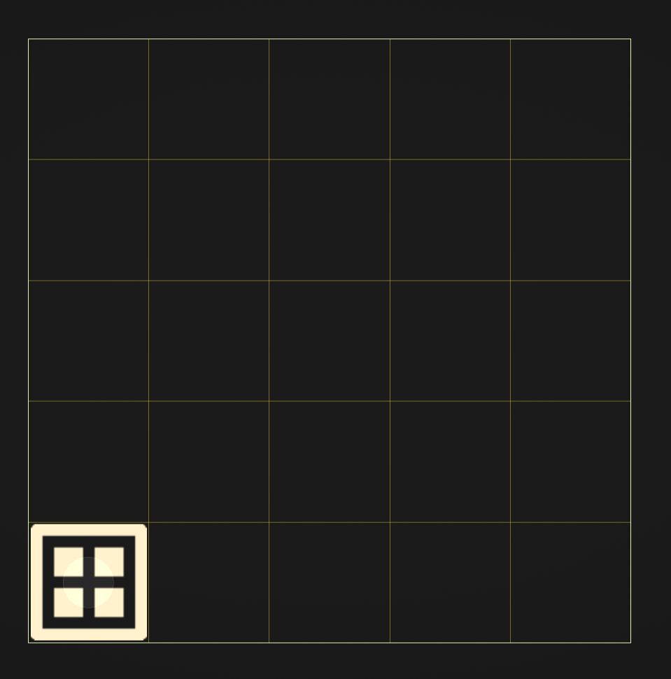
    </a>
</div>

You can select a cell to check its info by right-clicking on it:
 <div align="center">
        
    </a>
</div>

On the left of the screen, a grid editor will appear where you can check and edit the cell infos.<br>
Be sure to click <b>Finish Edit</b> after editing.<br>

<div align="center">
        
    </a>
</div>

<h5>Methods</h5>

<b>Vector2Int CellFromWorldPos(Vector3 pos)</b><br>
<i>World position to cell ID.</i><br>
<br>
<b>Vector3 WorldPosFromCell(Vector2Int cell)</b><br>
<i>Cell ID to world position.</i><br>
<br>
<b>List<Vector2Int> CellsFromWorldPos(Vector3 pos1, Vector3 pos2)</b><br>
<i>Get all cells covered in the square area defined by pos1 and pos2.</i><br>
<br>
<b>List<Vector2Int> CellsFromCoordinate(Vector2Int cell1, Vector2Int cell2)</b><br>
<i>Get all cells in the range defined by two cell IDs.</i><br>
<br>
<b>void SetCellColor(int x, int y, Color color, bool apply = true)</b><br>
<i>Set the color of a cell.</i><br>
<i>apply: if true, the changes will be visible immediately.</i><br>
<br>
<b>void SetCellColor(List<Vector2Int> cells, Color color, bool apply = true)</b><br>
<i>Set the color of multiple cells.</i><br>
<br>
<b>void EraseCellColor(int x, int y, bool apply = true)</b><br>
<i>Reset a cell color to the default.</i><br>
<br>
<b>void EraseCellColor(List<Vector2Int> cells, bool apply = true)</b><br>
<i>Reset multiple cell colors to the default.</i><br>
<br>
<b>void AddCellColor(int x, int y, Color colorInc, bool apply = true)</b><br>
<i>Add to a cell color.</i><br>
<br>
<b>Color GetCellColor(int x, int y)</b><br>
<i>Get a cell color.</i><br>
<br>
<b>void SetCellColorRange_Circle(CellOperator op, int x, int y, Color c1, Color c2, int radius)</b><br>
<i>Set cell colors in a circular range.</i><br>
<i>op: set, add, or multiply.</i><br>
<i>c1: color at the center of the range.</i><br>
<i>c2: color at the border of the range.</i><br>
<br>
<b>void SetCellColorRange_Square(CellOperator op, int x, int y, Color c1, Color c2, int radius)</b><br>
<i>Set cell colors in a square range.</i><br>
<i>op: set, add, or multiply.</i><br>
<i>c1: color at the center of the range.</i><br>
<i>c2: color at the border of the range.</i><br>
<br>
<b>void SetCellColorRange_Star(CellOperator op, int x, int y, Color c1, Color c2, int radius)</b><br>
<i>Set cell colors in a star range.</i><br>
<i>op: set, add, or multiply.</i><br>
<i>c1: color at the center of the range.</i><br>
<i>c2: color at the border of the range.</i><br>
<br>
<b>void SaveGridToAssets(SKGridAsset asset)</b><br>
<i>Save the current grid to the grid asset.</i><br>
<br>
<b>void LoadGridFromAssets(SKGridAsset asset, bool generateStructure = true)</b><br>
<i>Load the current grid from the grid asset.</i><br>
<br>


#### 10.3 Pathfinding
SKGrid supports three pathfinding algorithms:<br>
A*, B*, and BFS.<br>
<br>
The grid holds the following values for each cell:

```csharp
public int[,] pf_ParentCell; //0:Left, 1:Right, 2:Up, 3:Down, 4:LU, 5:LD, 6:RU, 7:RD
public float[,] pf_FValue; //F(x)=G(x)+H(x)
public int[,] pf_CellCost; //0:Free to walk, 1:Unwalkable
```

<h5>Using Pathfinding</h5>
Using pathfinding to generate a path, simply call:
<b>SKGridLayer.PathfindingStart(Vector2Int startCell, Vector2Int endCell)</b>. This returns a list of cells that represents the shortest path.

```csharp
//Get a path from (1,2) to (5,9)
SKGridLayer grid;
List<Vector2Int> myPath = grid.PathfindingStart(new Vector2Int(1,2), new Vector2Int(5,9));
```
Alternatively, you can also do this separately:

```csharp
//Get a path from (1,2) to (5,9)
SKGridLayer grid;
grid.PathfindingSetStartPoint(1,2);
grid.PathfindingSetEndPoint(5,9);
List<Vector2Int> myPath = grid.PathfindingStart();
```

<h5>Setting Obstacles</h5>
To assign walkability for each cell, set their <b>cell values</b>. A cell value of 0 means free to walk, while a cell value of 1 means unwalkable.<br>
Run pathfinding then, the algorithm will give you a shortest path without using unwalkable cells.<br>

You can also ignore the cell costs using this overload:

```csharp
List<Vector2Int> PathfindingStart(bool ignoreCellCost = false)
```

<h5>Pathfinding Directions</h5>
There are two direction settings available:<br><br>
- 4 directions (up, down, left, right)<br>
- 8 directions (up, down, left, right, up-left, up-right, down-left, down-right)<br>
<br>
This defines which cells we can go when doing pathfinding. You can set this in the inspector or by setting

```csharp
SKGridLayer.directionAllowed
```

#### 10.4 Grid Occupancy
<i>[Legacy] Usable but can be replaced by cell values.</i>


### 11. Path Designer
The path designer component gives an easy solution to make an object move along a path. This can be used to create moving platforms, enemies, simple animations, etc.<br>
<br>

#### 11.1 Getting Started
To use SKPathDesigner, <br>
<br>
1. Turn on <b>Gizmos</b>.
2. Create a sprite.<br>
3. Add SKPathDesigner component onto it.<br>
4. Click <b>Add Waypoint</b> in the inspector.<br>
5. Play!<br>
<br>
You should see your sprite move horizontally for several seconds.
<div align="left">
        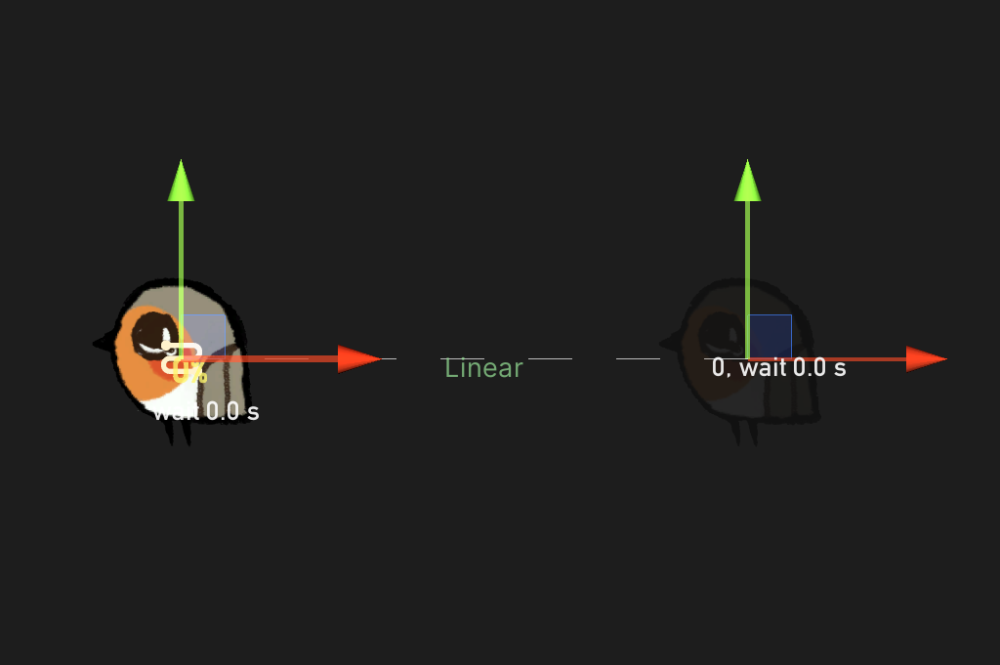
    </a>
</div>

#### 11.2 Waypoints
A path is comprised of multiple <b>waypoints</b>.<br>
In SKPathDesigner, each waypoint has the following properties:<br>

- ID<br>
- Type (line or curve)<br>
- Wait time (seconds to wait on this waypoint)<br>
- Position <br>
- Movement curve (animation curve to define how fast the object moves along the way)<br>
- Bezier control points (if this waypoint corresponds to a curve, use 2 control points to make the curve)<br>

For example:
<div align="left">
        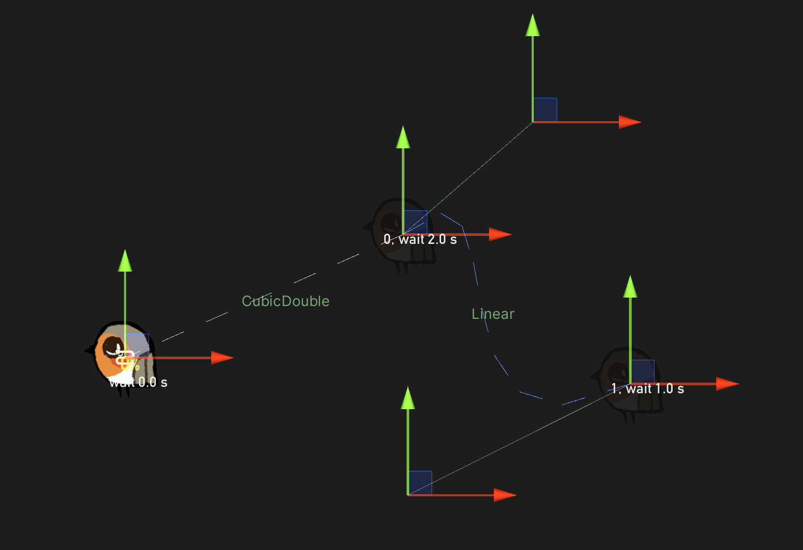
    </a>
</div>
In this scenario, there are three waypoints:<br>
<br>
<b>Waypoint Start</b>: This is where the path starts.<br>
<br>
<b>Waypoint 0</b>: <br>
- Type: Line <br>
- Wait time: 2.0s <br>
- Movement curve: Cubic Double <br>
<br>
<b>Waypoint 1</b>: <br>
- Type: Curve <br>
- Wait time: 1.0s <br>
- Movement curve: Linear <br>
<br>

<h5>Movement Curve</h5>
Visualize each line segment between waypoints as a segment from 0 to 1. The movement curve uses an <a href="##_31-skcurve">Animation Curve</a> to define its speed along the way. For example, <b>Cubic Double</b> represents a slow-fast-slow movement.<br>

<h5>Bezier Curves</h5>
SKPathDesigner uses <a href="##_36-bezier-curve">Bezier Curves</a> to represent curves. Each segment requires 2 control points each extending in tangent direction from a waypoint.<br>

#### 11.3 SKPathDesigner

<h5>Structure</h5>
<div class="row">
  <div class="columnTall">
  <b>Path Player</b> 
  <br>This allows you to preview the movement along the path in scene view.<br>
  <br>
  <b>Translate Mode</b> 
  <br>There are 3 modes available:<br>
  - One time<br>
  - Ping pong<br>
  - Repeat<br>
  <br>
  <b>Normalized Time</b> 
  <br>Drag this to see the movement along the path. 0 is starting point, 1 is ending point.<br>
  <br>
  <b>Speed</b> 
  <br>Speed of movement.<br>
  <br>
  <b>Bezier Segments</b> 
  <br>Smoothness of bezier curves. More segments means smoother curves and lower efficiency.<br>
  <br>
  <b>On Point Threshold</b> 
  <br>How close should the object be from waypoints to be considered "arrived"?<br>
  <br>
  <b>Speaker Image</b> 
  <br><a href="##_56-skimage">SKImage</a> component that displays speaker's avatar.<br>
  <br>
  <b>Start on Awake</b> 
  <br>Play the sequence on awake.<br>
  <br>
  <b>Waypoint Editor</b> 
  <br>Add, delete, and modify waypoints here.<br>
  <br>
  </div>
  <div class="columnTall">
  <div align="center">
        
    </a>
</div></div></div>
<h5>Methods</h5>
<b>void StartPath()</b><br>
<i>Start movement along this path. Will restart if called during a movement.</i><br>
<br>
<b>void PausePath()</b><br>
<i>Pause the ongoing movement.</i><br>
<br>
<b>void AddWaypoint(SKTranslatorWaypoint waypoint)</b><br>
<i>Add a new waypoint.</i><br>
<br>
<b>void DeleteWaypoint(SKTranslatorWaypoint waypoint)</b><br>
<i>Remove a waypoint.</i><br>
<br>
<b>Vector3 GetNormalizedWPosition(float t)</b><br>
<i>Get position along the path. t from 0 to 1 representing the whole path.</i><br>
<br>


### 12. Physics & Movement 

#### 12.1 SKMeasurer
SKMeasurer is a simple editor tool to display distances between objects.<br>
<div align="center">
        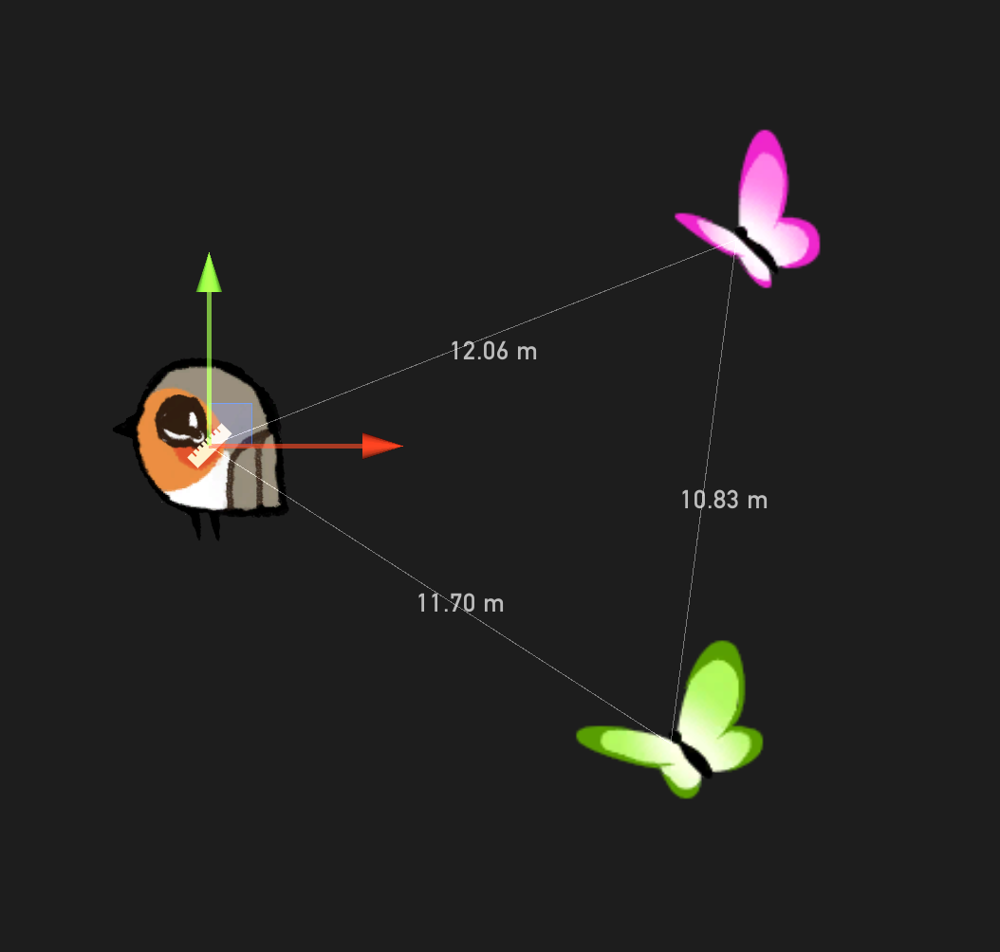
    </a>
</div>

<h5>How to Use</h5>
1. Select the object from which you want to measure.<br>
2. Add the destination objects in the inspector.<br>

<h5>Measure Modes</h5>
There are two measure modes:<br>
- <b>Every Object.</b> In this mode, distances of all pairs of measured objects will be displayed.<br>  
- <b>Next Object.</b> In this mode, only the distances of consecutive pairs of measured objects will be displayed.<br>  

#### 12.2 SKSceneObjectResponder
SKSceneObjectResponder is a component to recieve and send scene object mouse events:<br>
- OnMouseOver<br>
- OnMouseExit<br>
- OnMouseDown<br>
- OnMouseUp<br>
- OnMouseEnter<br>
- OnMouseDrag<br>
<br>
<h5>How to Use</h5>
1. Add a collider and an SKSceneObjectResponder to your object.<br>
2. Register to the events:

```csharp
SKSceneObjectResponder responder = go.GetComponent<SKSceneObjectResponder>();
responder.onMouseOver += MyOnMouseOver;
```

You can also get the state of mouse over by:

```csharp
responder.isMouseOver
```
#### 12.3 SKColliderResponder
SKColliderResponder is a component to recieve and send collision and trigger events:<br>
- OnTriggerEnter<br>
- OnTriggerStay<br>
- OnTriggerExit<br>
- OnCollisionEnter<br>
- OnCollisionStay<br>
- OnCollisionExit<br>
- OnTriggerEnter2D<br>
- OnTriggerStay2D<br>
- OnTriggerExit2D<br>
- OnCollisionEnter2D<br>
- OnCollisionStay2D<br>
- OnCollisionExit2D<br>
<br>
<h5>How to Use</h5>
1. Add a collider, a rigidbody and an SKColliderResponder to your object.<br>
2. Select which type of event you want to enable:<br>
    - Trigger3D<br>
    - Collision3D<br>
    - Trigger2D<br>
    - Collision2D<br>
3. Register to the events:

```csharp
SKColliderResponder responder = go.GetComponent<SKColliderResponder>();
responder.OnTriggerEnter += MyOnMouseOver;
```

You can also set the <b>max count of events sent</b> by setting in the inspector. (e.g. you only want to use this collider once) <br>

```csharp
responder.maxEventCount
```
A max event count of <b>-1</b> means unlimited event count.

#### 12.4 SKCldResponderManager
SKCldResponderManager gives a way to manager all the SKColliderResponders in the scene.<br>
<br>

Each responder can be given a string ID in the inspector.<br>
On start, responders will register themselves to the responder manager.<br>
<br>
<h5>Methods</h5>
<b>SKColliderResponder GetResponder(string uid)</b><br>
<i>Get a responder by its uid.</i><br>
<br>
<b>SKColliderResponder GetLastResponder()</b><br>
<i>Get the last responder which invokes a valid event.</i><br>
<br>

In this way, you don't need references to get collider events.<br>
```csharp
//EXAMPLE: Add event when the head collider is hit
string CLD_TAG_HEAD = "cld_head";
SKColliderResponder head_res = SKCldResponderManager.GetResponder(CLD_TAG_HEAD);
head_res.OnCollisionEnter += OnHeadHit;
```

#### 12.5 SKObjectDragger
Add SKObjectDragger to an object, you can drag it with the mouse.<br>

<h5>How to Use</h5>
1. Add a collider and an SKObjectDragger to an object.<br>
2. Play and drag the object!<br>

<h5>Translation Constraints</h5>
You can enable/disable translation on the X and Y axes by setting in the inspector.

<h5>Inertia</h5>
You can enable/disable/edit inertia in the inspector. This allows the object to move a little further after you stop dragging.

<h5>Events</h5>
The following events are available:<br>
- OnBeginDrag<br>
- OnDrag<br>
- OnEndDrag<br>
- OnStop<br>

#### 12.6 SKObjectRotater
Add SKObjectRotater to an object, you can rotate it with the mouse.<br>

<h5>How to Use</h5>
1. Add a collider and an SKObjectRotater to an object.<br>
2. Play and rotate the object!<br>

<h5>Sensitivity</h5>
You can adjust the mouse sensitivity in the inspector.

<h5>Rotation Constraints</h5>
You can enable/disable rotation on the X and Y axes by setting in the inspector.

<h5>Inertia</h5>
You can enable/disable/edit inertia in the inspector. This allows the object to rotate a little more after you stop dragging.

<h5>Events</h5>
The following events are available:<br>
- OnBeginDrag<br>
- OnDrag<br>
- OnEndDrag<br>
- OnStop<br>

#### 12.7 SKObjectScaler
Add SKObjectScaler to an object, you can scale it with the mouse.<br>

<h5>How to Use</h5>
1. Add a collider and an SKObjectScaler to an object.<br>
2. Play and scale the object!<br>

<h5>Sensitivity</h5>
You can adjust the mouse sensitivity in the inspector.

<h5>Scaling Constraints</h5>
You can enable/disable scaling on the X, Y, and Z axes by setting in the inspector. There are also constraints on the min/max scales.

<h5>Events</h5>
The following events are available:<br>
- OnBeginDrag<br>
- OnDrag<br>
- OnEndDrag<br>
- OnStop<br>

#### 12.8 SKRotateAnim
SKRotateAnim lets you add simple rotation animation to an object.<br>

<div align="left">
        
    </a>
</div>
<b>Speed</b><br>
<i>Speed of rotation.</i><br>
<br>
<b>Orientation</b><br>
<i>Clockwise or counterclockwise.</i><br>
<br>
<b>Mode</b><br>
<i>Linear or ping-pong.</i><br>
<br>
<b>Axes</b><br>
<i>Rotate around the X, Y, or Z axis.</i><br>
<br>
<b>Speed Randomization</b><br>
<i>Randomize rotate speed on start.</i><br>
<br>
<b>Orientation Randomization</b><br>
<i>Randomize orientation on start.</i><br>
<br>

<h5>How to Use</h5>
1. Attach SKRotateAnim to an object.<br>
2. Play!<br>

### 13. Audio & Video
With SKCell, you can easily deploy audio and video clips in your game.<br>

#### 13.1 SKAudioManager

<h5>How to Use</h5>
1. Under the <b>Assets</b> directory, create two folders: <b>Assets/Resources/AudioClip/Sound</b> and <b>Assets/Resources/AudioClip/Music</b>.<br>
2. Put your audio clips in these folders.<br>
3. Create a new game object and add to it the SKAudioManager component.<br>
3. Call

```csharp
SKAudioManager.PlaySound(...);
```
or
```csharp
SKAudioManager.PlayMusic(...);
```
to play the audio clips!<br>
<br>
<i>There are no real difference between sound and music. They are just there as an indentifier.</i><br>

<h5>Methods</h5>
<b>AudioSource PlaySound(string id, Action action = null, bool loop = false, float volume = 1f, float pitch = 1f, float damp =0.5f)</b><br>
<i>Play a sound.</i><br>
<i>action: the action to call after playing the sound.</i><br>
<br>

```csharp
//EXAMPLE: you have clip.wav under Assets/Resources/AudioClip/Sound
audioManager.PlaySound("clip"); //Play the clip
audioManager.PlaySound("clip", null, true); //Loop the clip
```
<b>AudioSource PlayIdentifiableSound(string fileName, string id, bool loop = false, float volume = 1, float damp = 0.5f)</b><br>
<i>Play a sound and assign to it an ID (for stopping it).</i><br>
<br>

```csharp
//EXAMPLE: you have clip.wav under Assets/Resources/AudioClip/Sound
audioManager.PlayIdentifiableSound("clip","id_001"); //Play the clip
audioManager.StopIdentifiableSound("id_001"); //Stop the clip
```
<b>void StopIdentifiableSound(string id, float dampTime = 0.15f)</b><br>
<i>Stop a sound according to an ID.</i><br>
<br>
<b>void StopSound()</b><br>
<i>Stop the last sound.</i><br>
<br>
<b>AudioSource PlayMusic(string id, bool loop = true, int type = 2, float volume = 1f)</b><br>
<i>Play a music.</i><br>
<br>
<b>void ChangeSoundVolume(float volume)</b><br>
<i>Change the overall volume of sound.</i><br>
<br>
<b>void ChangeMusicVolume(float volume)</b><br>
<i>Change the overall volume of music.</i><br>
<br>

#### 13.2 SKVideoManager
SKVideoManager allows you to play video clips by one line of code.<br>

<h5>Play a video clip fullscreen</h5>
Use the <b>VideoPlayer PlayVideo(string path, bool isLoop=false)</b> method.<br>
<i>path: this is the resources path.</i><br>

```csharp
SKVideoManager.PlayVideo("Opening/FirstScene");
```
This method plays the video fullscreen.<br>

<h5>Play a video clip on UI component</h5>
You can play video clips on a <b>RawImage</b>.<br>
Use the <b>void PlayVideoInUI(string path, RawImage rawImage)</b> method.<br>
<i>path: this is the resources path.</i><br>

```csharp
RawImage screen;
SKVideoManager.PlayVideo("Opening/FirstScene", screen);
```

### 14. Editor Interfaces
SKCell brings a series of editor interface improvements to Unity.<br>

#### 14.1 Hierarchy Window
<div class="row">
  <div class="column">
  <b>Features</b><br>
  <br>
  - <b>Separators</b> (marked as blue)<br>
    <i>End a game object name with "-" to mark it as a separator.</i><br>
    <br>
  - <b>Shortcut: Enabling/Disabling</b> (check box to the right)<br>
    <i>Enable or disable a game object by selecting the check box.</i><br>
    <br>
  - <b>Shortcut: Rename</b> ("A" button to the right)<br>
    <i>Rename a game object by clicking the "A" button.</i><br>
    <br>
  - <b>Appearance</b><br>
    <i>Two consecutive rows have a slight color difference.</i><br>
    <i>Colored bar to the left to indicate parent/child layers.</i><br>
    <br>
  </div>
  <div class="column">
  <div align="center">
        
    </a>
</div></div></div>

<h5>Customizing Colors</h5>
You can customize colors for the hierarchy window by selecting <b>SKCell/Hierarchy Style</b> from the menu bar.<br>
Close the customization window to apply changes.<br>

#### 14.2 Transform Component
Select <b>Show Transform Ext</b> to view extra info.
<div class="row">
  <div class="column">
  <b>Features</b><br>
  <br>
  - <b>Local & World Spaces</b><br>
    <i>View transform values in both local & world spaces.</i><br>
    <br>
  - <b>Copy & Paste Transform Values</b><br>
    <i>Copy & Paste transform values between game objects.</i><br>
    <br>
  </div>
  <div class="column">
  <div align="center">
        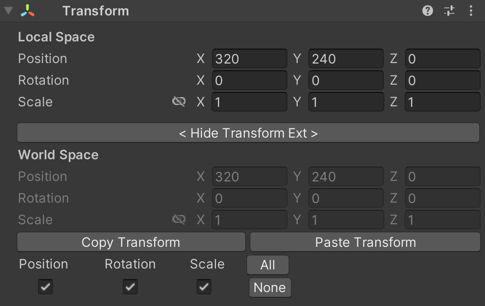
    </a>
</div></div></div>

#### 14.3 Project Window
Select <b>SKCell/File Details...</b> from the menu bar to see file details in the project window.<br>
File details are only visible when the project window has the <b>min display size</b>.<br>
 <div align="center">
        
    </a>
</div>
  <b>Properties available for display</b><br>
  <br>
  - <b>Animation Key Count</b><br>
    <br>
  - <b>Animation Length</b><br>
    <br>
    - <b>Asset Type</b><br>
    <br>
    - <b>File Size</b><br>
    <br>
    - <b>File Suffix</b><br>
    <br>
    - <b>GUID</b><br>
    <br>
    - <b>Path</b><br>
    <br>
    - <b>Texture Format</b><br>
    <br>
    - <b>Texture Size</b><br>
    <br>
    - <b>Texture Wrap Mode</b><br>
    <br>

### 15. Editor Tools

#### 15.1 Sprite Colorer
The sprite colorer allows you to assign a single color to a sprite. (will affect all non-transparent pixels)
<br>
Select <b>SKCell/Tools/Sprite Colorer</b> to open the window. Detailed instructions are written there.

#### 15.2 Texture Utils
The texture utilities allows you to assign types, formats, and sizes for all the textures in your projects.
<br>
Select <b>SKCell/Tools/Texture Utils</b> to open the window. 


## Dev Log

<b>v0.13.x</b>								  
2023.10
-   Custom editor update! New features include: custom object icons, automatic project folder icons, inline inspector attributes, etc.
-	Added SKFolderIconSetter, SKFolderChangeProcessor, SKAttributeDrawer, SKBehaviourEditor, SKMonoAttribute, etc.
-   Added inspector attributes: SKFolder, SKEndFolder, SKConditionalField, SKResettable, SKInspectorButton, SKInspectorText
-   Enhanced SKHierarchy
-   Added new editor icons
    <br>0.13.1
    - Added project folder colors and button styles
    - Optimized project editor performance
    <br>0.13.2
    - Added ActiveOnAwake.
    - Added more supported types for project folder colors
    - Changed hierarchy separator visuals
    - Changed SKCore inspector visuals
    <br>0.13.3
    - Added SKUIScene for demo purposes
    - Fixed bugs associated with SKTextAnimator
    <br>0.13.4
    - Added SKInspectorScene for demo purposes
    - Added inspector attribute: SKSeparator
    - Fixed bugs associated with SKBehaviourEditor, SKFolderIconSetter, SKSpriteProcessing, and SKImageProcessing


<b>v0.12.x</b>								  
2023.3
-	Added SKSpriteEditor
-	Added 4 tools to SKSpriteEditor: select, brush, eraser, color picker
-   Added 5 utilities to SKSpriteEditor: brightness, saturation, contrast, color erase, gaussian blur
-   Optimized SKHierarchy, updated appearance
    <br>0.12.1
    - Various bug fixes
    <br>0.12.2
    - Added SKLineAnim to Effects module
    <br>0.12.3
    - Fixed issues with SKDialogue Scene
    - Add SKLineAnim prefab
    - Updated SKQuitControl
    - Bug fixes and routine maintenance


<b>v0.11.x</b>								  
2022.12
-	Reorganized project
-	Added full documentation
-   Removed all third-party assets
-   Removed ReplaceableMonoSingleton
-   Removed MeshToPrefabUtils
-   Removed Native Utilities
-   Bug fixes
    <br>0.11.1
    - Fixed issues with SKColliderResponder
    - Added return value of Tweening functions
    - Added API for SKPathDesigner

<b>v0.10.x</b>								  
2022.9
-	Added Dialogue Module (SKDialoguePlayer, SKDialogueAsset, SKDialogueEditor, SKDialogueEditorNode, SKDialogueManager, SKDialoguePlayerEditor)
-	Incorporated dialogue system with SKTextAnimator and SKLocalization systems
-	Added fast-forward function to SKTextAnimator
-	Added new environment effect packs
    <br>0.10.1
    - Added SKQuitControl to Editor module
    <br>0.10.2
    - Added noise texture packs
    - Bug fixes


<b>v0.9.x</b>									  
2022.8
- Added Movement Module (SKPathDesigner, SKPathDesignerEditor, SKPathDesignerPreview)
- Added SKBezier to Structure Module
- Added SKUIShadow, SKBackBlur to Effects Module
- Minor changes to SKCurve and SKAssetLibrary
- Added SKHierarchy to Editor Module
- Updated various icons
    <br>V0.9.1
    - Added SKTextAnimator, SKTextAnimation, SKTextData, SKTextEffects, SKTextUtils to Effects Module
    - Added scaling, translation, rotation, wave, shake, color, and alpha effects to SKTextAnimation
    <br>V0.9.2
    - Added dangle, banner, exclaim, and twinkle effects to SKTextAnimation
    - Completed SKTextAnimator functionalities
    <br>V0.9.21
    - Integrated SKTextAnimator-related functions with SKText and SKLocalization
    <br>V0.9.3
    - Added SKMeasurer to Physics&GO module.
    - Added several icons.

<b>v0.8.x</b>								  
2022.4
- Added MathLibrary
- Added MonoCore & MonoBase to Common Module
- Added SKCell.cginc to Graphics Module
- Fixed SK asset path bugs
    <br>0.8.1
    - Optimized Localization Module. Added subpages.
    - Fixed font chart bugs.

<b>v0.7.x</b>									  
2022.3
- Added Event module (EventDispatcher, EventHandler, EventRef)
- Added Effect module (SKSpriteProcessing, SKImageProcessing,
SKSpriteBlur)
- Added Sprite Colorer to Editor Module
- Removed DOTween from the package
    <br>V0.7.1
    - Fixed editor namespace problems with SKGridLayer.
    - Fixed SKCore building errors.
    - Optimized CommonUtils.StartProcedure method.
    <br>V0.7.2
    - Added AnimationRandomizer to effect module
    <br>V0.7.3
    - Added Light2D to effect module
    <br>V0.7.4
    - Added several fonts to font module. 
    - Reorganized package structure
    - Removed all third-party dependencies.

<b>v0.6.x</b>								  
2021.8
- Added FSM module. (FSM, FSMSystem, FSMTransition, FSMEvent)
- Added component icons.
    <br>V0.6.1
    - Added ReplaceableMonoSingleton to common module.
    <br>V0.6.2
    - Added MinHeap and MaxHeap to structure module. 
    <br>V0.6.3
    - Added ITreeNode, TreeNode, ITree, TreeStructure to structure module.
    <br>V0.6.4
    - Added sorting utilities to CommonUtils.

<b>v0.5.x</b>										  
2021.7
- Added grid module. (SKGrid, SKGridLayer, SKGridEditor, SKGridLayerEditor, SKGridOccupier, etc.)
    <br>V0.5.1
	- Improved SKGrid performance.
    - Added SKSpriteTools to editor module.
    <br>V0.5.2
    - Added SKTransformExt to editor module.
    <br>V0.5.3
    - Added EditorCoroutineManager to editor module.
    <br>V0.5.4
    - Added command pattern scripts. (ICommand, Command, CommandManager)

<b>v0.4.x</b>								  
2021.5
- Added native module. (NativeUtility, AndroidUtility, IphoneUtility)
    <br>V0.4.1
	- Added SKCurve / SKCurveSampler to structure module.
    <br>V0.4.2
	- Added SKSceneObjectResponder to Physics module.
    <br>V0.4.3
	- Added SKObjectDragger, SKObjectRotater, and SKObject Scaler to Physics module.


## License

Released under [MIT](/LICENSE) by [@Alex Liu].

- You can modify and reuse this project.
- Please link back to the original repo somewhere in your project if you use this in any way.
- Including an original license copy.
    - If you add content from [docs](/docs/) to your repo (or click _Use this template_) and then modify for your own needs so your copy is no longer a template, then you don't need to include a license.
    - If you do fork this repo then use it as your own _template_, then this project's license and copyright notice must be **included** with the software. [source](https://choosealicense.com/licenses/#mit). Copy `LICENSE` to `LICENSE-source` and then update your copy of `LICENSE` with your own details.